% Normdaten in Wikidata
% 
% SS 2014

# Vorwort {.unnumbered}

Dieses Handbuch entstand innerhalb von drei Monaten im Rahmen eines Projektseminars an der Hochschule Hannover (HsH). Neun Studierende des Bachelor-Studiengangs Informationsmanagement hatten im 6. Semester unter Projektleitung von Jakob Voß die Aufgabe, ohne wesentliche Vorkenntnisse ein Handbuch zum Thema "Normdaten in Wikidata" zu erstellen. Die Hauptautorinnen und -Autoren dieses Handbuchs sind Franziska Ludemann, Viktoria Berkelmann, Janna Kitroschat, Jasmin Bogner, Julian Schmitt, Katharina Seljuzki, Maiia Bartoshevska, Oliver Löffel und Susanna Bausch.

Zur Verwaltung der Inhalte dieses Handbuchs wird ein Repository des Versionskontrollsystem  *git* verwendet, das alle Bearbeitungsschritte und Änderungen beinhaltet. 

Das Handbuch gliedert sich in einen theoretischen ersten Teil, welcher die grundlegenden Eigenschaften von Wikidata und Normdaten in Wikidata erläutert. Im zweiten Teil erhält der Leser einen Einblick in das praktische Arbeiten mit und in Wikidata. Abgerundet wird der Text durch zahlreiche Beispiele, Merkkästen und ein umfangreiches [Glossar](#glossar). 

**Was benötigt man für die Benutzung?**
- Internetverbindung
- Benutzeraccount bei Wikidata

Beispiele und wichtige Hinweise sind durch Merkkästen wie diesen hier hervorgehoben. Alle  **fett markierten** Begriffe im Fließtext werden im [Glossar](#glossar) definiert. Interne Verweise auf Kapitel dieses Handbuchs sind mit einem Pfeil gekennzeichnet.

Des Weiteren existieren externe Verlinkungen, zum Beispiel [Wikidata-Hauptseite](https://www.wikidata.org/w/index.php?title=Wikidata:Hauptseite&oldid=119860805). Zu dieser Form zählen alle Literaturhinweise und Quellen dieses Handbuches. Auch externe Verlinkungen zu Wikidata-Items und Wikidata-Eigenschaften erscheinen mit Schreibmaschinenschrift, zum Beispiel Japan [`Q17`](https://www.wikidata.org/wiki/Q17)). 

Da es sich um ein dynamisches Projekt handelt, ist es möglich, dass die im Buch abgebildeten Screenshots nicht dem aktuellen Webseitendesign entsprechen. Der letzte Stand der Screenshots ist Mai 2014.

# Einleitung

Das Handbuch bietet eine detaillierte Anleitung zur Verwendung und Unterstützung des Wikidata-Projektes. Es werden wichtige Fachbegriffe erläutert und eine reichhaltige Bebilderung wird Ihnen die Abläufe und Möglichkeiten von Wikidata einfach und verständlich erklären.

Benutzer können in Wikidata Einträge ([Items](#wikidata-items)) anlegen, die Einträge durch [Aussagen](#wikidata-aussagen) beschreiben und mit anderen Items verknüpften. Mit [Belegen](#belege) und [Qualifikatoren](#qualifikatoren) können Aussagen belegt und in einen Kontext eingesetzt werden. Um die Qualität einer Aussage einstufen zu können helfen [Ränge](#ränge), die als Qualitätsfaktoren zum Einsatz kommen. Benutzer können Verknüpfungen erstellen. Beispielsweise können Sie Objekte zu Personen mit einem Geburtsort, mit ihrer Beschäftigung oder mit ihrem Eintrag in einer Normdatei verknüpfen oder einen Politiker einer Partei zuordnen. Benutzer können einem Berggipfel, Plätzen oder einem Gebäude Geokoordinaten geben, eine Kommune der nächsthöheren Verwaltungseinheit zuordnen, einem Land das Staatsoberhaupt und die Nationalhymne verlinken usw. All diese Informationen können in jeder Sprache genutzt werden, um sie in Infoboxen in der eigenen Sprache anzuzeigen, auch wenn alle Informationen aus einer anderen Sprache stammen.

Die Begriffsdefinitionen zu [Normdaten](#einführung-in-normdaten) leiten den Hauptteil des Buches, den Theorieteil ein. Hier wird neben der Definition auch die Anwendungsweise erklärt. Dabei wird auf die Entstehung von Wikidata als [Datenbank](#wikidata-als-datenbank) und auf die Inhalte, inklusive [Ziele](#ziele-von-wikidata) eingegangen. Dem schließen sich die Begriffserklärung [Wikidata] (#entstehung-von-wikidata) und die Geschichte dieses Projektes an. Über Wikidata und die [Inhalte](#inhalte-von-wikidata) bzw. Ziele von Wikidata lernt der Benutzer die Oberfläche von Wikidata näher kennen und findet hier auch eine [Oberflächenbeschreibung](#bestandteile-von-wikidata "Oberflächenbeschreibung")  vor.

[Wikidata-Items](#wikidata-items) stellt in Wikidata eine zentrale Einheit dar. Des Weiteren ist das Erstellen von neuen [Wikidata-Eigenschaften](#wikidata-eigenschaften) ein wichtiger Punkt. Dabei werden auch die sogenannte ID-Referenzierung und entsprechende Beispiele aufgezeigt. [Übersetzungen in Wikidata](#übersetzungen-in-wikidata "Übersetzungen in Wikidata") erklärt Möglichkeiten und Hilfen für diese Tätigkeit. Erklärt werden "Universale Sprachauswahl", "Babel-Bausteinen" und "Liste der Bezeichnungen". Dabei wird auch auf die Weiternutzung von vorhandenen Daten eingegangen.

Das Handbuch verfügt auch über [FAQ](#faq) welches die dringendsten Fragen beantwortet. Ein [Glossar](l#glossar "Glossar") mit Begriffserklärungen rundet das Ganze ab. Ein [Literaturverzeichnis](#literaturverzeichnis "Literaturverzeichnis") mit weiterführenden Links und empfehlenswerten Büchern/Links enthält ausführliche Informationen für den Leser. Die [Liste aller Normdaten-Eigenschaften](l#liste-aller-normdaten-eigenschaften "Liste aller Normdaten-Eigenschaften") beenden das Handbuch.

# Einführung in Normdaten

Eine **Normdatei** ist ein Verzeichnis von normierten Begriffen zur Verwendung als **Deskriptor** in der Dokumentation. Im Englischen werden Normdateien als „authority files“ bezeichnet. Normierte Begriffe können Personennamen, Körperschaftsnamen und beliebige andere Mengen von Bezeichnungen von Dingen, Vorgängen oder abstrakten Vorstellungen sein. Der Bildung von Normbegriffen liegt eine **Ontologie** (Hierarchie & Relation) zugrunde, die die jeweils zu normierenden Begriffe und die Art der Normierung festlegt. Die Normbegriffe gehören nach Vergabe zu den **Metadaten** des jeweiligen Datensatzes.

Mit **Normdaten** kann man eindeutig auf verschiedene Objekte (beispielsweise Orte, Person, Themen, Organisationen) verweisen. Normdaten werden unter anderem in Bibliotheken zur Erschließung und zur **Indexierung** von Dokumenten eingesetzt. Beispiele für Normdateien sind die **GND** (Gemeinsame Normdatei), die ICD-10 (eine **Klassifikation** für Krankheiten) oder der Art & Architecture Thesaurus (ein **Thesaurus**). Einzelne Normdatensätze werden in einer Normdatei durch eindeutige Benennungen ("bevorzugte Benennungen") oder durch ID-Nummern identifiziert. Mithilfe von **Mapping** können verschiedenen Informationssystemen interoperal Normdateien abgleichen und eine **Konkordanz** zwischen Normdateien erstellen. Eine Konkordanz ist eine Liste, in der alle Stellen angegeben sind, in der das gesuchte Wort vorkommt. 

Ausschnitt des Normdatensatz zu "Hannover" in der GND, wie er im [Katalog der Deutschen Nationalbibliothek](http://d-nb.info/gnd/4023349-2)  abgerufen werden kann:

~~~
ID: http://d-nb.info/gnd/4023349-2
Geografikum (Ort): Hannover
Andere Bezeichnung: 
  Oberstadtdirektor <Hannover> (Spitzenorgan)
  Hannover / Referat für Stadtentwicklung (Spitzenorgan)
  Hannover / Oberbürgermeister (Spitzenorgan)
Definition: 
  Hauptstadt des Landes Niedersachsen, Verwaltungssitz der  Region Hannover, 1150 als Marktsiedlung Hanovere urkundl. erwähnt, 1202  Stadtrecht
Land:  Niedersachsen (XA-DE-NI); Deutschland, Deutsches Reich (XA-DXDE)
DDC-Notation: T2--435954
Typ: Gebietskörperschaft, Verwaltungseinheit (gik)
Urheber von: 
  ...
Beteiligt an:
  ...    
Thema in:
  ...    
~~~

Sie sehen hier im Merkkasten ausschnittsweise, dass Hannover der offizielle Name der Stadt ist (bevorzugte Benennung). Daneben gibt es noch andere Bezeichnungen, eine kurze Beschreibung, was der Datensatz beinhaltet und woran dieser Datensatz beteiligt ist (aktiv oder passiv in Publikationen).

# Einführung in Wikidata

Wikidata ist eine frei zugängliche und eine frei veränderbare Datenbank. Wie unter [Entstehung von Wikdata](#entstehung-von-wikidata) beschrieben, dient Wikidata in erster Linie als zentrale Datenbank für alle Projekte der Wikimedia Foundation. Unabhängig davon kann Wikidata aber [auch als Normdatei](#normdaten-in-wikidata) verwendet werden. Die Inhalte sind durch Angabe der [CC-Lizenz](http://creativecommons.org/publicdomain/zero/1.0/deed.de) gemeinfrei, das heißt ohne Einschränkungen zur [Nutzung in anderen Anwendungen](#weiternutzung-in-anderen-anwendungen). Im Folgenden wird zunächst erklärt, [was für eine Art von Datenbank](#wikidata-als-datenbank) Wikidata ist und [was für Inhalte](#inhalte-von-wikidata) darin zu finden sind. Wenn Sie mehr an der [praktischen Anwendung](#praktische-anwendung "praktischen Anwendung") oder an den [Bestandteilen von Wikidata](#bestandteile-von-wikidata) interessiert sind, können Sie auch gleich zu den entsprechenden Kapiteln springen.

## Entstehung von Wikidata

Das Wikidata-Projekt wurde im April 2012 durch die Wikimedia Foundation ins Leben gerufen und von Wikimedia Deutschland umgesetzt. Das primäre Ziel von Wikidata war es, Wikipedia und andere Wikimedia-Projekte durch eine zentrale Datenbank zu unterstützen, die Möglichkeiten von Wikidata gehen jedoch weit darüber hinaus.  Nach Wikipedia, Wiktionary, Wikibooks, Wikiquote, Wikisource, Wikinews und Wikiversity war Wikidata das erste neue Projekt der Wikimedia-Foundation seit 2006 (inzwischen ist außerdem Wikiversity hinzugekommen). Die Entwicklung von Wikidata wurde durch mehrere Großspenden finanziert. Ab Ende Oktober 2012 konnten in Wikidata Bearbeitungen vorgenommen werden.

Die Entwicklung von Wikidata wurde in drei Phasen aufgeteilt: 

* In Phase 1 wurden Sprachlinks von Wikipedia-Beiträgen in Wikidata zu 
[Items](#wikidata-items) mit Beschreibungen und Bezeichnungen versehen. Um dies zu vereinfachen, wurden automatische **Bots** verwendet. Seit dem 24. April 2013 können in allen Wikipedia-Sprachversionen Wikidata-Metadaten eingebunden und dargestellt werden. 

* Phase 2 beinhaltete die Aufgabe, dass zu den Items [Aussagen](#wikidata-aussagen) hinzugefügt werden konnten. Dies geschah unter anderem ebenfalls mit Bots und dem Datenfundament aus Wikipedia-Infoboxen-und -Kategorien.

* Phase 3 ist noch nicht abgeschlossen. Es soll automatische Übersetzungen und Aktualisierungen von Listen ermöglichen, basierend auf mehrsprachigen Daten von Wikidata.  Außerdem sollen alle Daten von Wiki-Links, Infoboxen und Listen aufgenommen und vereinigt werden. 

Wikidata hat einige Vorläufer in verwandten Projekten wie [Semantic MediaWiki](http://semantic-mediawiki.org/) und [DBPedia](http://dbpedia.org/). Im Gegensatz zu diesen basiert Wikidata jedoch nicht auf Techniken des Semantic Web.

## Ziele von Wikidata

Hauptziel von Wikidata ist es eine strukturierte und zentralisierte "Wissensdatenbank" zu schaffen, welche die reale Welt in Daten und Fakten beschreibt und abbildet. Statt in Wikipedia die verschiedensprachigen Artikel manuell zu erstellen, sollen in Wikidata Fakten hinterlegt werden, die in jeder Version gleich angezeigt werden. Mit Hilfe diese einheitliche Erfassung sollen vor allem statistische Angaben und formal beschreibbare Metadaten über mehrere Seiten und Sprachversionen hinweg in Wikipedia aktualisiert werden können. Wie Beispielsweise die Höhe des Mount Everest oder die offizielle Einwohnerzahl von New York automatisch in allen Sprachversionen aktualisiert werden bei einer Änderung. Die dabei entstehenden Infoboxen werden in einer zentralen Datenbank effizient, widerspruchsfrei und dauerhaft gespeichert. Sie dienen als Quellen für alle anderen [Wikipedia  Schwesterprojekte](http://de.wikipedia.org/w/index.php?title=Wikipedia:Schwesterprojekte&oldid=127371039).

## Wikidata als Datenbank

Wikidata ist vor allem eine freie Datenbank, und somit ist es ein System zur elektronischen Datenverwaltung, die von Menschen wie auch von Maschinen gelesen und bearbeitet werden kann. Wikidata kann über Links mit anderen Projekten der Wikimedia Foundation und andern Datensätzen verknüpft werden, wodurch die Möglichkeit die Quellen zu überprüfen besteht.
 
Die Wikidata Datenbank besteht aus einem Computerprogramm zur Verwaltung von Daten (Datenbankmanagementsystem) und darin gespeicherten Daten (**Datenbestand** oder Datenbasis). Im Falle von Wikidata besteht das Datenbankmanagementsystem aus der Wikidata-Software, die sich aus einer Wiki-Komponente namens **MediaWiki** und einer Datenbank-Komponente namens **Wikibase** zusammensetzt. MediaWiki wird auch für Wikipedia und die anderen Projekte der Wikimedia-Foundation eingesetzt, während Wikibase speziell für Wikidata entwickelt wurde.

Wie jedes Datenbankmanagementsystem legt Wikibase fest, welche Struktur die gespeicherten Daten grundsätzlich haben können. Für den Datenbestand von Wikidata gilt, dass dieser aus [Items](#wikidata-items), [Eigenschaften](#wikidata-eigenschaften) und [Aussagen](#wikidata-aussagen) besteht.

## Inhalte von Wikidata

Grundsätzlich enthält Wikidata **Daten**. Daten bestehen aus Zeichen, die von Computern verarbeitet werden können. Eine allgemein anerkannte Definition von Daten gibt es jedoch nicht. Dies liegt unter anderem daran, dass drei verschiedene Sichtweisen auf Daten möglich sind, die im Folgenden erklärt sind.

* Die Sicht auf "Daten als Fakten" entspringt einer naiv-naturwissenschaftlichen Weltsicht, nach der Daten Informationen über die Welt repräsentieren oder enthalten. Im Wesentlichen ist Wikidata durch diese Sicht motiviert. Wikidata soll Fakten sammeln und eine Sammlung des Wissens unserer heutigen Zivilisation ermöglichen. 

* Im Gegensatz dazu geht die Sicht auf "Daten als Beobachtungen" davon aus, dass alle Angaben über die Welt subjektiv sind. Um Daten zu interpretieren, ist deshalb immer ein Kontext notwendig. Kontexte können unter anderem dabei helfen, verschiedene Bedeutungen von Daten zu erkennen und einzuschätzen wie vertrauenswürdig und nützlich Daten sind. Wikidata sieht mehrere Verfahren zur Angabe von Kontextinformationen vor (siehe die Kapitel zu [Belegen](#belege) und [Qualifikatoren](#qualifikatoren)). Da diese Informationen wiederum selbst nur als Daten vorliegen, lässt sich das Problem der Subjektivität von Daten aber nicht vollständig lösen.

* Die Sicht auf "Daten als digitale Dokumente oder Objekte" ist vor allem bei digitalen Medien wie Texten, Bildern, Filmen oder Musik üblich. Die Wikimedia-Foundation betreibt zur Sammlung solcher Dokumente das digitale Medienarchiv Commons. Grundsätzlich lassen sich aber alle Daten auch als digitale Dokumente auffassen. So sind alle Bearbeitungen und Inhalte von Wikidata gleichzeitig Dokumente des menschlichen Antriebs die Welt zu verstehen und zu interpretieren.

Zusammengefasst ist Wikidata eine Datenbank, die sowohl Fakten als auch dokumentierte Beobachtungen enthält. Die Inhalte von Wikidata sind dabei so kodiert, dass sie automatisch verarbeitet und weiterverwendet werden können.

# Bestandteile von Wikidata

Die Datensätze von Wikidata bestehen in der Regel immer aus einer einheitlichen Struktur. Das nun folgende Kapitel möchte die elementaren Bau- und Bestandteile von Wikidata-Datensätzen vorstellen. Dazu gehören die Wikidata-Items, die [Eigenschaften](#wikidata-eigenschaften) und die [Aussagen](#wikidata-aussagen). Ferner finden sich in den folgenden Kapiteln Erläuterungen zu Datentypen, Rängen, Belegen und Qualifikatoren. 

## Wikidata-Items

Ein **Item** (deutsch: **Datenobjekt**) stellt in Wikidata eine zentrale Einheit dar. Fast alles kann in Wikidata zu einem Item werden (ausgenommen sind Daten, die keinem Kontext zugeordnet sind), vor allem aber Gegenständlichkeiten, Konzepte und Vorstellungen. Ein Item besteht immer aus einer Datensatz-ID, die sich aus dem Buchstaben `Q` und einer Nummer zusammensetzt. Beispielsweise steht `Q17` für Japan. Jedes Item kann pro Sprache einen Namen und eine Kurzbeschreibung sowie mehrere Alternativnamen (Synonyme) haben. Dies trägt noch weiter zu einer eindeutigen Identifizierung bei. Weitere Bestandteile von Items sind Links zu Seiten in Wikimedia-Projekten (Wikipedia, Wikivoyage, Wikimedia Commons und so weiter) sowie  [Aussagen](#wikidata-aussagen) mit Eigenschaften, Werten und Belegen. Die Relevanzrichtlinien von Wikidata verlangen, dass nur Items erstellt werden sollen, die mit Seiten anderer Wikimedia-Projekte verlinkt sind (siehe [Items erstellen](#neue-items-anlegen "Items erstellen")). 

Die Seite des Items setzt sich aus verschiedenen Komponenten zusammen (siehe Abbildung unten).

Ganz oben steht der Name des Items mit ID (in diesem Fall "Japan ([`Q17`](https://wikidata.org/wiki/Q17))") und darunter folgt eine Kurzbeschreibung dieses Items sowie Synonyme. Es werden außerdem Übersetzungen des Items und der Kurzbeschreibung angezeigt. 

Nach den Übersetzungen kommen die [Aussagen](#wikidata-aussagen). Aussagen lassen sich aufteilen in [Eigenschaft](#wikidata-eigenschaften) und Wert. Sie dienen dazu, das Item näher zu beschreiben. Eigenschaften beschreiben (immer gleichbleibende) Merkmale der Inhalte, welche in den Werten eingetragen werden können. Der Wert hingegen ist das Rohdatum, welcher das Item näher beschreiben soll. Im obigen Beispiel ist "DDC" eine Aussage und "T2--52"  ein der Eigenschaft zugewiesener Wert. 

## Wikidata-Eigenschaften

**Eigenschaften** (englisch "properties") werden in Wikidata benutzt, um Aussagen auszudrücken.

Jede Eigenschaft wird durch eine ID referenziert, die mit `P` anfängt. Beispielsweise steht in Wikidata `P19` für den Geburtsort einer Person. Jede Eigenschaft kann ebenso wie Wikidata-Items mit Übersetzungen und Aussagen (siehe Kapitel [Wikidata-Aussagen](#wikidata-aussagen)) beschrieben werden. So lautet beispielsweise die englische Bezeichnung für die Eigenschaft `P19` "place of birth" und die Deutsche Beschreibung "Ort, in dem ein Mensch geboren wurde". 

Zur Ansicht und Bearbeitung der Benennungen und weiterer Angaben zu Aussagen hat jede Eigenschaft in Wikidata eine eigene Seite. Die URL (Uniform Resource Locator) dieser Seite lässt sich durch Voranstellen von `https://www.wikidata.org/wiki/Property:` konstruieren.

Die Ansicht der Eigenschaft [`P19`](https://www.wikidata.org/wiki/Property:P19) können Sie unten im Screenshot betrachten. 

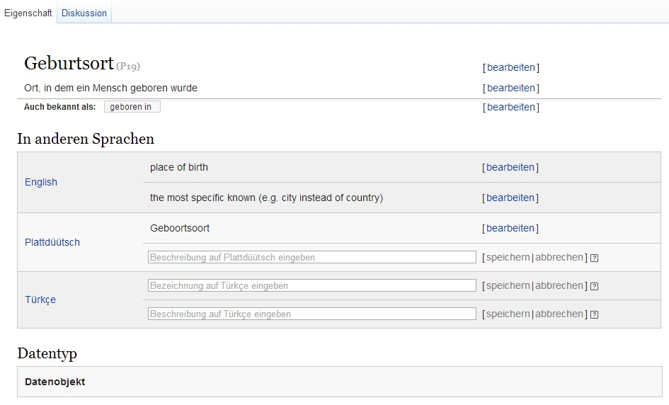

### Vorhandene Eigenschaften

Jede Aussage auf einer Item-Seite stellt eine Verbindung zu einer Eigenschaft her und weist ihr einen Wert zu. Dieser Wert besitzt wiederum eine Verlinkung zu der Item-Seite dieses Wertes.

Einige Eigenschaften sind dazu gedacht von Wikidata-Items auf andere Normdateien zu verweisen. Genauer beschrieben wird dies im Kapitel [Normdaten-Eigenschaften in Wikidata](#normdaten-eigenschaften-in-wikidata).

Eigenschaften können wie Wikidata-Items von allen Mitarbeitern bearbeitet werden, beispielsweise mit Übersetzungen und Beschreibungen der jeweiligen Eigenschaft. 

Das Anlegen neuer Eigenschaften ist jedoch nur ausgewählten Mitgliedern der Wikidata-Community möglich.

Auf der Seite [Eigenschaften vorschlagen](https://www.wikidata.org/wiki/Wikidata:Property_proposal/de) können Vorschläge für neue Wikidata-Eigenschaften eingebracht und von der Wikidata-Community diskutiert werden. 

### Datentypen und andere Einschränkungen

In Wikidata existieren verschiedene **Datentypen**, welche in [einer Liste](https://www.wikidata.org/wiki/Special:ListDatatypes?uselang=de) zu finden sind. Datentypen haben die Aufgabe zu bestimmen, welche Art von Werten den Eigenschaften zugeordnet werden können. Für jede Eigenschaft ist vordefiniert, welche Datentypen sie als Wert "akzeptiert" ansehen. Beispielsweise sind keine Buchstaben oder sonstige Zeichen für Zahlenfelder bei der GND-Nummer einzugeben.

**Die wichtigsten Datentypen und eine Beispiel-Eigenschaft:**

Im Moment können in Wikidata sieben Datentypen (Item, Commons media file, String, Time, Geographic coordinates und URL) für Eigenschaften verarbeitet werden. 

_Datentyp: Item_

In diesen Datentyp können Verknüpfungen zu anderen Items in Wikidata eingegeben werden. Die Eingabe erfolgt über ein einfaches Texteingabefeld. 

_Datentyp: Mediendatei/Media file/Commons_

Dieser Datentyp übernimmt die Verlinkung zu Mediendokumenten. Vor allem Bilder, Videos und Klänge, welche auf Wikimedia Commons gespeichert sind. Auf diese Weise können die Mediendokumente einem Wikipediaartikel zugeordnet werden. 

_Datentyp: Zeichenkette/String_

Dieser Datentyp akzeptiert als Eingaben alle Zeichenketten. Diese sollten nach Möglichkeit jedoch nicht sprachenabhängig sein, wie zum Beispiel nicht übersetzbare Konzepte wie Eigennamen. 

_Datentyp: Zeit/Time_

Hier können nur Werte eingegeben werden, welche eine zeitliche Information ausdrücken. Zum Beispiel Jahreszahlen, Jahres-Datums-Zahlen, Zeitzonen, Zeitpunkte und noch einige mehr. Für mehr Informationen können Sie [hier](https://www.wikidata.org/wiki/Special:ListDatatypes) weiterlesen. 

_Datentyp: Geographische Koordinaten/Geographic coordinates_

In diesem Datentyp finden alle Werte mit geografischen Informationen ihren Platz. Dazu zählen vor allem Daten von Breiten- und Längengraden wie bei Ortsbestimmungen und die Position von Sternen beziehungsweise Sternenbildern. 

_Datentyp: URL_

In diesem Datentyp werden externe URLs abgelegt. Die URLs müssen hierbei Protokollen gehorchen, die auch für alle Interwikilinks von Wikidata gelten. 

_Datentyp: Menge/Quantity_

In diesem Datentyp können Mengenangaben eingegeben werden. Das sind in der Regel vor allem Zahlenwerte wie zum Beispiel die errungenen Wählerstimmen bei einer Wahl. 

Für ausführlichere technische Informationen schauen Sie auf die Seite des [Datenmodells in Wikidata ](https://www.mediawiki.org/wiki/Wikibase/DataModel).

## Wikidata-Aussagen

Jedes [Wikidata-Item](#wikidata-items) kann mit Aussagen beschrieben werden. Im Wesentlichen besteht eine Aussage aus einer [Eigenschaft](#wikidata-eigenschaften) und einem Wert. Beispielsweise enthält das Item für die Stadt Hannover ([`Q1715`](https://www.wikidata.org/wiki/Q1715)) eine Aussage, die angibt, dass sich Hannover in Deutschland befindet. Die entsprechende Eigenschaft dafür hat die Bezeichnung "Staat" ([P17](https://www.wikidata.org/wiki/Property:P17)). Aussagen in Wikidata können mit einem anderen Wikidata-Item oder mit einem externen Link verlinkt werden, oder durch eine Eigenschaft inhaltlich oder objektiv beschrieben. 
Der aufgerufene Datensatz im Screenshot ist Hannover. Die Eigenschaft Staat beschreibt das interne Wikidata-Item Deutschland. Die Eigenschaft LCNAF (Library of Congress Name Authoryity File) gibt einen externen Link wieder. Die KFZ- Kennzeichnung ist ein Beispiel für eine einfache Wertbeschreibung. 

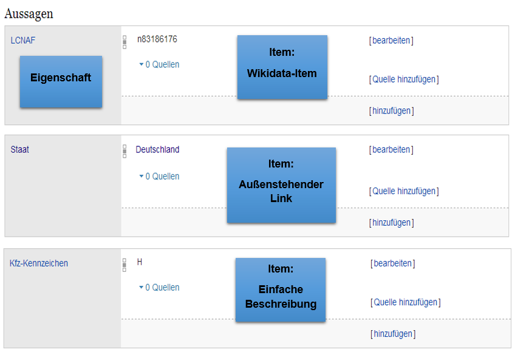

Genauere Informationen finden Sie unter [Behauptungen und Aussagen](http://www.wikidata.org/wiki/Wikidata:Glossary/de#Behauptungen_und_Aussagen).

### Qualifikatoren

**Qualifikatoren** werden in Wikidata benutzt, um eine Aussage näher zu beschreiben. Viele Aussagen benötigen weitere Qualifikatoren, um richtig interpretiert werden zu können. Sie liefern also zusätzliche Informationen und bestehen genau wie Aussagen aus einer Eigenschaft und einem Wert. 

Qualifikatoren können auf drei unterschiedliche Arten eingesetzt werden. Die erste Art verändert die Anwendung der Eigenschaften; wie zum Beispiel das Benennen eines ausgeschlossenen Landstücks bei einer Flächen Eigenschaft. Die zweite Art der Qualifikatoren beschränkt die Gültigkeit des Wertes, 
beispielsweise eine Beschränkung der Jahreszahl bei einer Volkszählung. Die dritte Art der Qualifikatoren gibt weitere Details zu einer Aussage an, wie zum Beispiel der Beginn und Endzeitpunkt einer Herrschaft. 

**Beispiel für Berlin (`Q64`)(Objekt)**

Bevölkerung (Eigenschaft): 3'500'000 (Wert der Eigenschaft)
point in time (`P585`): (Qualifikator): 2005 (Wert des Qualifikators)
determination method (`P459`) (Qualifikator): Schätzung (Wert des Qualifikators)

Weitere Informationen zu Qualifikatoren stehen in Wikidata in der [Liste von Qualifikatoren](https://www.wikidata.org/wiki/Help:Qualifiers/de). 

### Ränge

**Ränge** sind Qualitätsfaktoren, die helfen, die Qualität einer Aussage einzustufen. Das Ranking wird nur angewandt, wenn es zu einem Item mehrere Aussagen mit der gleichen Eigenschaft gibt. Es gibt drei mögliche Rangstufen:

1. Herabgestufter oder zweifelhafter Rang, für Aussagen, die nicht als zuverlässig betrachtet werden können oder von denen man weiß, dass sie Fehler enthalten.
2. Der Normale Rang ist für Aussagen, die relevante Informationen enthalten. Diese Informationen gelten allgemein als korrekt. 
3. Vorrangig ist ein Rang, bei Aussagen mit den wichtigsten und aktuellsten Informationen.

Aussagen ohne Belege sowie Aussagen, die ohne weitere Hinweise aus einer anderen Datenbank kopiert wurden (Belege mit der Eigenschaft "Datenherkunft" ([`P143`](https://www.wikidata.org/wiki/Property:P143)) sollten grundsätzlich als zweifelhaft eingestuft werden.

Weitere Informationen zu Rängen stehen in Wikidata unter [Ranking](https://www.wikidata.org/wiki/Help:Ranking). 

### Belege

Aussagen in Wikidata können und sollten möglichst zusätzlich mit **Belegen** versehen werden. 

Es gibt einige [Ausnahmen](http://www.wikidata.org/wiki/Help:Sources/Itemsnotneedingsources/de), wie unter anderem

* Wenn der Wert allgemein bekannt ist und nicht bestritten wurde.
* Wenn das Element sich auf einer externen Quelle bezieht. Es ermöglicht, die Informationen den anderen verbundenen Aussagen leicht zu überprüfen. Es ist somit nicht nötig, die referenzierten Quellen als Beleg in Wikipedia zu haben. 
* Wenn das Item selbst als Beleg für Aussagen über seinen Gegenstand dient -- beispielsweise sind die Autoren und Autorinnen eines Buches in der Regel dem Buch selbst zu entnehmen.

Belege bestehen aus mindestens einer Eigenschaft und einem Wert. Die erste Aussage des Items [Deutschland <code>(Q183)</code>](https://www.wikidata.org/wiki/Q183) lautet "Mitglied von Welthandelsorganisation". Zu dieser Aussage gibt es drei Belege. Jeder Beleg setzt sich zusammen aus "Datenherkunft", "URL" und "Zitat". 

Der erste Beleg ist komplett aufgeklappt im Screenshot zu sehen. Genauer betrachtet ist der Beleg in drei Eigenschaften aufgegliedert. "Datenherkunft", "URL" und "Zitat" sind jeweils die Eigenschaften und das darauf Folgende (für "Datenherkunft" zum Beispiel "Bundesministerium für Wirtschaft und Technologie") sind Werte.

Es ist nicht das primäre Ziel der Wikidata, detaillierte Eigenschaften von Belegen zu modellieren. In seiner einfachsten Form ist ein Beleg nur ein Pfad, der einem Leser den Weg zu einem Beleg zeigt. Einige Belege können auch selbst Items in Wikidata beinhalten. Ein Wikipedia-Artikel über ein Buch kann beispielsweise auch als Beleg verwendet werden.
Sie können auch widersprüchliche Aussagen beinhalten, zum Beispiel ein Buch kann mehrere Kapitel enthalten, in denen verschiedene Autoren widersprüchliche Informationen angeben.

Neben expliziten Belegen, die Aussagen in Wikidata durch einen Verweis auf ein Dokument nachweisen, kann jeder Bearbeitungsvorgang in Wikidata als impliziter Beleg aufgefasst werden. 
Zu ihrer Beurteilung können explizierte Belege ebenso wichtig sein, wie Informationen darüber, von wem und zu welchem Zeitpunkt eine Aussage in Wikidata angelegt wurde. Belege "zweiter Ordnung", das heißt Belege die auf andere Quellen verweisen, in wissenschaftlichen Texten kenntlich durch die Phrase "zitiert nach", sind in Wikidata nicht vorgesehen.

Die genauen Richtlinien für Belege sind in Wikidata unter [Hilfe:Belege](http://www.wikidata.org/wiki/Help:Sources/de) aufgeführt.

# Normdaten in Wikidata

Der Datenbestand von Wikidata bildet eine eigene [Normdatei](#einführung-in-normdaten) deren Normdatensätze aus den [Wikidata-Items](#wikidata-items) bestehen. Beispielsweise kann das Wikidata-Items [`Q17`](https://www.wikidata.org/wiki/Q17) (Japan) als Deskriptor verwendet werden, um Literatur über Japan zu kennzeichnen. Im Folgenden ist beschrieben, wie Wikidata durch [Normdaten-Eigenschaften](#normdaten-eigenschaften-in-wikidata) mit anderen Normdateien verknüpft ist und worin sich Wikidata als Normdatei von [anderen Normdateien unterscheidet](#unterschiede-zu-anderen-normdateien).

## Normdaten-Eigenschaften in Wikidata

Eigenschaften, die unter einer Notation oder ID zusammengefügt werden, bezeichnet man als Normdaten-Eigenschaften. Normdaten können ein- oder mehrsprachig sein. Wikidata dagegen ist meistens mehrsprachig. Verknüpfungen zwischen Normdaten aus Wikidata und Dokumenten in Wikipedia ist ein Ziel des Wikidata-Projektes und wird bereits zu Teilen umgesetzt. 

Wikidata enthält zahlreiche [Eigenschaften](#wikidata-eigenschaften) zum Verlinken von Wikidata-Items mit Normdatensätzen aus anderen Normdateien. Beispielsweise kann mit der Eigenschaft "GND-Nummer" ([`P227`](https://www.wikidata.org/wiki/Property:P227)) vom Wikidata-Item [`Q17`](https://www.wikidata.org/wiki/Q17) auf den Normdatensatz [`4028495-5`](http://d-nb.info/gnd/4028495-5) zu Japan in der Gemeinsamen Normdatei verwiesen werden oder mit der Eigenschaft "DDC" ([`P1036`](https://www.wikidata.org/wiki/Property:P1036)) auf die Notation `T2--52` der Dewey-Dezimalklassifikation. Diese **Normdaten-Eigenschaften** bilden Mappings zwischen Wikidata und anderen Normdateien.  

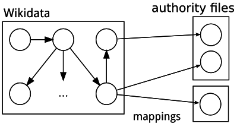

Alle Normdaten-Eigenschaften haben den [Datentyp](#datentypen-und-andere-einschränkungen) Zeichenkette/String gemeinsam, da der Wert eine Aussage mit Normdaten-Eigenschaft und einer Notation, ID-Nummer oder Ähnlichem ist.

Eine garantiert aktuelle Übersicht aller Eigenschaften, die speziell dazu dienen, auf Normdateien zu verweisen, existiert nicht. Die [tabellarische Übersicht aller Eigenschaften](https://www.wikidata.org/w/index.php?title=Wikidata:List_of_properties/Summary_table/de&oldid=120803723) enthält eine manuell gepflegte Liste, aus der die meisten Normdaten-Eigenschaften hervorgehen. 

Da jederzeit neue Eigenschaften in Wikidata hinzukommen können (siehe [Neue Eigenschaften vorschlagen](#neue-eigenschaften-vorschlagen)) ist es schwierig eine vollständige Liste von Normdaten-Eigenschaften anzugeben. Im Anhang ist eine [Liste aller Normdaten-Eigenschaften](#liste-aller-normdaten-eigenschaften) zum Erstellungszeitpunkt dieses Handbuchs enthalten. Unter [Property proposal/Authority control](https://www.wikidata.org/wiki/Wikidata:Property_proposal/Authority_control) in Wikidata finden sich Vorschläge für neue Normdaten-Eigenschaften.

**Beispiele für Normdaten-Eigenschaften**
 
* GND-Nummer ([`P227`](https://www.wikidata.org/wiki/Property:P227))
* LCNAF ([`P244`](https://www.wikidata.org/wiki/Property:P244))
* VIAF ([`P214`](https://www.wikidata.org/wiki/Property:P214))
* Web NDL Authorities ([`P349`](https://www.wikidata.org/wiki/Property:P349))
* ISO-Norm ([`P503`](https://www.wikidata.org/wiki/Property:P503))
* ISIL-ID ([`P791`](https://www.wikidata.org/wiki/Property:P791))

    
## Unterschiede zu anderen Normdateien
Im Folgenden werden die Unterschiede zwischen Wikidata und der Gemeinsamen Normdatei (GND) kenntlich gemacht. 
 
Die Einträge bei Wikidata werden maßgeblich durch freischaffende Wikidataautoren und durch Bots erstellt. Jeder kann sich bei Wikidata anmelden und einen Eintrag hinterlassen. Die Wikidata-Datensätze werden in erster Linie für Wikipedia oder andere Wikimedia-Projekte erstellt.
Die Normdaten in Wikidata unterliegen einem Regelwerk, welches von der Wikidata-Community erarbeitet worden ist (und dynamisch neuen bzw. veränderten Anforderungen angepasst wird). 
Die Wikimedia-Foundation hat den Vorteil verschiedener Normdateien erkannt und bietet den Bearbeitern der Datensätze die Möglichkeit an, Normdaten (GND, LCCN, NDL, VIAF) in die Artikel einzubinden. 
 
Im Gegensatz dazu wird die Gemeinsame Normdatei (GND) von mehreren Institutionen verwaltet, unter anderem von der Deutschen Nationalbibliothek (DNB), allen deutschsprachigen Bibliotheksverbünden, der Zeitschriftendatenbank (ZDB) und zahlreichen weiteren Einrichtungen. 
Die Normdaten haben als Grundlage die Regeln der alphabetischen Katalogisierung (RAK-WB) und die Regeln für den Schlagwortkatalog (RSWK). 
Die GND zeichnet sich nicht nur durch ihre Vorzugsbenennungen aus, sondern vor allem durch ihre zahlreichen Synonyme (in anderen Sprachen und Schriften) und Verknüpfungen zu weiteren Datensätzen aus. 
 
 Weiterführende Literatur und Hilfen finden Sie in der [Wikidata Liste der Projektregeln und Richtlinien](https://www.wikidata.org/w/index.php?title=Wikidata:List_of_policies_and_guidelines/de&oldid=102532266) oder im [Hilfe-Portal Wikidata](https://www.wikidata.org/w/index.php?title=Help:Contents/de&oldid=66338607 ).

# Praktische Anwendung

Wikidata ist grundsätzlich ein freies Projekt, an dem jede Person mitarbeiten kann. Das folgende Kapitel möchte jedem Interessierten die Mitarbeit an Wikidata ermöglichen. Am Anfang erfolgt eine Erläuterung der Startseite von Wikidata und welche Funktionen für Bearbeiter von Bedeutung sind. 
Im zweiten Unterkapitel wird die Suchfunktion von Wikidata behandelt und vorgestellt. [Kapitel 6.3](#inhalte-finden-in-wikidata) und [6.4](#items-erstellen) erläutern im Detail wie Items und Aussagen in Wikidata angelegt und bearbeitet werden können. Danach folgen zwei Darstellungen, auf welche Weise man Übersetzungen anlegen bzw. die Oberflächenanzeige von Wikidata ändern kann. Zum Abschluss wird erläutert, wie man in Wikidata neue Eigenschaften vorstellungen kann und auf welche Weise man Wikidata in anderen Anwendungen benutzen kann. 

## Übersicht der Wikidata-Startseite
Für die aktive Benutzung von Wikidata empfiehlt sich der Besitz eines eigenen Accountes, damit bei eventuellen Änderungen andere Nutzer zuordnen können wer etwas geändert hat, um dann entsprechend darauf reagieren zu können. Einen Benutzeraccount können sie von jeder Wikidataseite aus anlegen. Der Button dafür befindet sich am oberen rechten Rand der Website.

In der obigen Abbildung sehen sie die deutsche Ansicht der Wikidata-Startseite im abgemeldeten Modus. Für die leichte Bedienbarkeit kann die Oberfläche von Wikidata in fast allen Sprachen angezeigt werden. Hier kann man zwischen zwei Ebenen unterscheiden, der Sprachauswahl für das Kontextmenü und der Sprachauswahl für den Inhaltsbereich. Ersteres ist im abgemeldeten Modus in der linken Spalte zu finden und letzteres findet sich zentral auf der Wikidata-Startseite. 
Der Unterschied zwischen diesen beiden Spracheinstellungen ist die Art, was sich auf der Website ändert. Bei der Sprachauswahl für das Kontextmenü ändern sich Menü-Punkte, automatisch generierte Buttons und alle weiteren Punkte, die nicht von Bearbeitern von Wikidata geschrieben bzw. programmiert wurden. Bei einer Änderung von Deutsch zu Japanisch ändert sich lediglich die Sprache der Bedienoberfläche, inhaltlich bleiben alle Texte in deutscher Sprache. 
Eine geänderte Sprachauswahl für den Inhaltsbereich ändert alle von Bearbeitern bzw. Benutzern Inhalte in die geänderte Sprache. Es werden also bei einer Änderung von Deutsch zu Japanisch alle Items und alle Hilfetexte in Japanisch angezeigt. 

## Spracheinstellung in Wikidata
Dieses Kapitel möchte zwei nicht uninteressante Themen anschneiden: wie kann der Benutzer die Sprache der Wikidata-Inhalte anpassen und wie ändert ein Nutzer die Oberflächensprache in seine bevorzugte Sprache? 

### Änderung der Inhaltssprache von Wikidata
Sie fragen sich vielleicht, warum gerade Englisch, Plattdeutsch und Türkisch als Sprachen vorgeschlagen werden. Es werden immer drei Sprachen aufgelistet und diese drei sind diejenigen, die in der Region des Nutzers (in diesem Fall also Deutschland) gesprochen werden.

Es gibt [zwei verschiedene Möglichkeiten](https://www.wikidata.org/wiki/Help:Multilingual/de) die Sprachen zu ändern.

**Universale Sprachauswahl**

Diese Methode ist die komplizierteste von zwei möglichen Varianten und diese zu erklären, würde den Rahmen sprengen, deshalb werden im Folgenden lediglich die Babel-Bausteine erklärt. Für Interessierte gibt es aber einen [weiterführenden Link](https://www.mediawiki.org/wiki/Universal_Language_Selector?setlang=de) mit weiteren Informationen zu dieser Einstellungsoption.

**Babel-Bausteine**

_Achtung: Diese Option ist nur für angemeldete beziehungsweise registrierte Nutzer verfügbar_

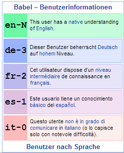 

Babel-Bausteine werden in die Benutzerseite geschrieben und dienen der Definition der eigenen Sprachkenntnisse. Nur die in den Bausteinen erwähnten Sprachen werden dann im Abschnitt "In anderen Sprachen" angezeigt. Um die Babel-Bausteine zu aktivieren, klickt man oben in der Leiste auf seinen Benutzernamen und gibt dort in die Benutzerbeschreibung den Baustein-Code, zum Beispiel `{{#babel:en|de-3|fr-2|es-1|it-0}}`, ein. Die Zahlen stehen hierbei für die Sprachkenntnisse, wobei 0 keine Kenntnisse bedeutet. Nach dem Speichern werden die Sprachkenntnisse auf der Benutzerseite wie abgebildet in einem Kasten dargestellt.

## Änderung der Oberflächensprache von Wikidata
Die Default-Spracheinstellung der Wikidata-Oberflächensprache ist Englisch. Wenn Sie nun die Benutzersprache von Englisch auf Deutsch umstellen möchten, dann ist die Sprachumstellung sehr einfach zu bewältigen. Auf der linken Seite der Wikidata-Startseite befindet sich eine Sprachauswahl und dort können sie jede Sprache (in unserem Fall Deutsch), die in Wikidata vorhanden ist, auswählen. 

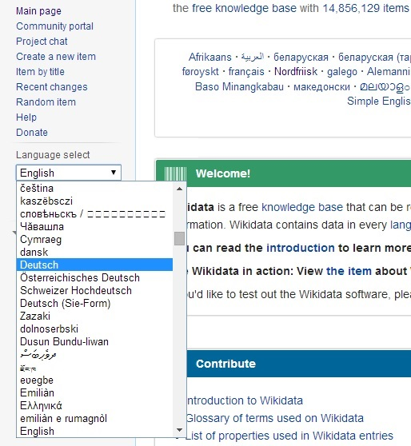

Zuletzt sei noch erwähnt, dass die Benutzeroberflächensprache lediglich die funktionalen Bestandteile von Wikidata übersetzt, d.h. die Inhalte von Wikidata (die Items, die Hilfeseiten, die Aussagen etc.) werden bei Default-Einstellungen immer noch in Englisch dargestellt. 

## Inhalte finden in Wikidata

Dieses Kapitel beschreibt verschiedene Suchmöglichkeiten um in Wikidata [Items](#suche-nach-items), [Eigenschaften](#suche-nach-eigenschaften) und [Aussagen](#suche-nach-aussagen) zu finden. Weitere Suchmöglichkeiten sind unter [Wikidata in anderen Anwendungen weiternutzen](#wikidata-in-anderen-anwendungen-weiternutzen) beschrieben.

### Suche nach Items

Um vorhandene [Items](#wikidata-items) zu finden gibt es hauptsächlich zwei Herangehensweisen. Einerseits die Eingabe eines Suchbegriffes in das Suchfeld, hierbei können unterschiedliche Ergebnisse angezeigt werden (Suchergebnisliste). Zu beachten ist, dass die Suche mit der Enter-Taste oder dem Klick auf das Lupensymbol ausgeführt wird. Andererseits kann nach der Eingabe eines Suchbegriffes über die Vorschau eine manuelle Auswahl zum konkreten Item führen (s.u.).  

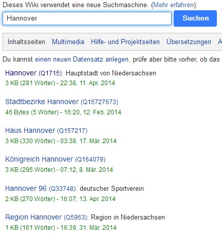

Die andere Möglichkeit ist die Eingabe einer konkreten Bezeichnung des Items und der manuellen Auswahl nach der Anzeige der Vorschauergebnisse. Das bevorzugte Ergebnis kann mit der Maus oder der Tastatur ausgewählt werden (+Enter-Taste). 

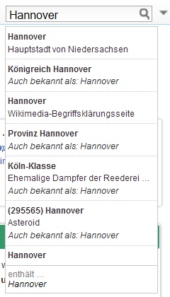

Weitere Suchoptionen kann man am einfachsten einblenden, wenn man die Enter-Taste in einem leeren Suchfeld betätigt. Man wird auf eine Art erweiterte Suche weitergeleitet. Wichtig für den Benutzer sind hier die Suchmöglich speziell nach Items ("Inhaltsseiten") und nach Hilfeseiten ("Hilfe- und Projektseiten"). 

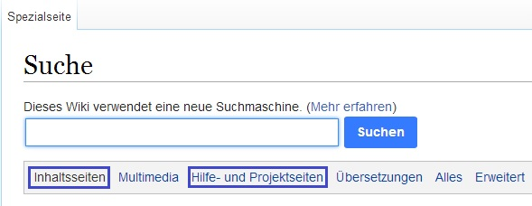

**Begriff Erklärungen/Menüpunkte**

Auf den Inhaltsseiten kann man nach sämtlichen Items von Wikidata suchen. Mit dem Reiter "Hilfe- und Projektseiten" ist es dem Benutzer möglich, nach Hilfen und anderen Erklärungen zu Elementen der Wikidata-Benutzung zu suchen. 

### Suche nach Eigenschaften

Ist man auf der Suche nach einer [Eigenschaft](#wikidata-eigenschaften) gibt es zwei Möglichkeiten, um eine Suche erfolgreich zu gestalten. Die Seite [Liste der Eigenschaften](https://www.wikidata.org/wiki/Wikidata:List_of_properties/de) verlinkt zu einer (unvollständigen) Übersicht und zu einer Suchmaske, in welcher man gezielt nach Eigenschaften suchen kann. Diese Möglichkeit ist dann sinnvoll, wenn man eine Eigenschaftsbezeichnung bereits kennt. 

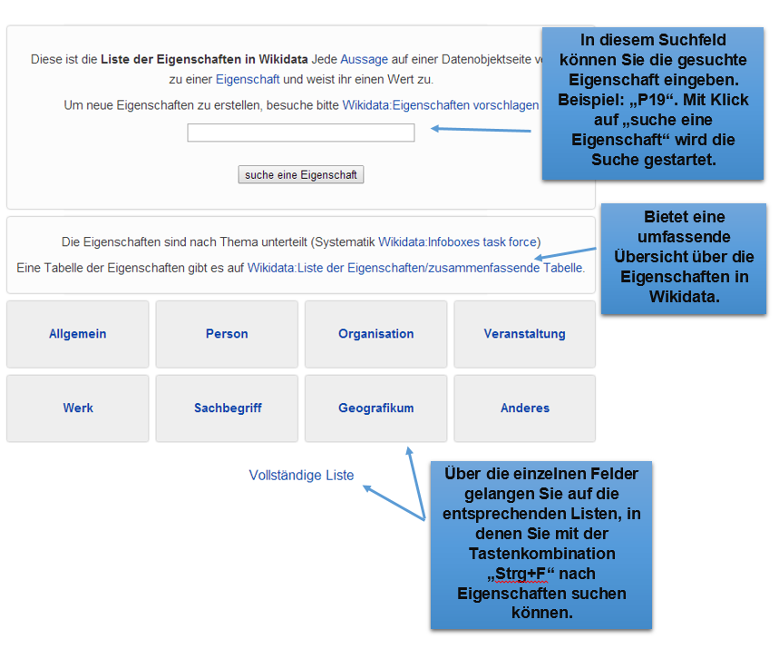

Wenn der Name der Eigenschaft nicht bekannt ist, gibt es die Möglichkeit mit Hilfe einer [Eigenschaftentabelle](https://www.wikidata.org/wiki/Wikidata:List_of_properties/Summary_table) diese Eigenschaft zu ermitteln. 

### Suche nach Aussagen 

_Dieser ganze Abschnitt ist völlig unverständlich. Er sollte besser mit dem Abschnitt [Komplexere Abfragen und Analysen](#komplexere-abfragen-und-analysen) koordiniert werden! _

Wie können vorhandene [Aussagen](#wikidata-aussagen), beispielsweise mit Normdateneigenschaften, abgefragt werden?

Beispielsweise können alle Personen aufgelistet werden, die in einer bestimmten Stadt geboren sind.

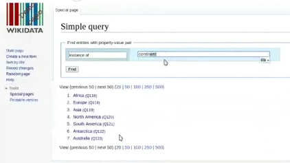

Im Kapitel [Weiternutzung in anderen Anwendungen](#weiternutzung-in-anderen-anwendungen) ist beschrieben, dass in Wikidata keine umfassenden Datenbankabfragen durchgeführt werden können. Es sind hierfür andere Anwendungen, wie zum Beispiel die Webanwendung WikiData Query (WDQ), erforderlich. 

## Wikidata-Bearbeitungen
Im nun folgenden Kapitel soll ihnen gezeigt werden, wie man ein Item neu anlegt, wie man Übersetzungen zu Bezeichnungen und Beschreibungen erstellt und wie Aussagen neu definiert bzw. bearbeitet werden können. 

### Neue Items anlegen
Bevor man ein neues Item erstellt, sollte man überprüfen ob [dieses Item bereits existiert](https://www.wikidata.org/wiki/Special:ItemByTitle?uselang=de). Die Suche wird im Kapitel [Inhalte finden](#inhalte-finden-in-wikidata) erklärt.

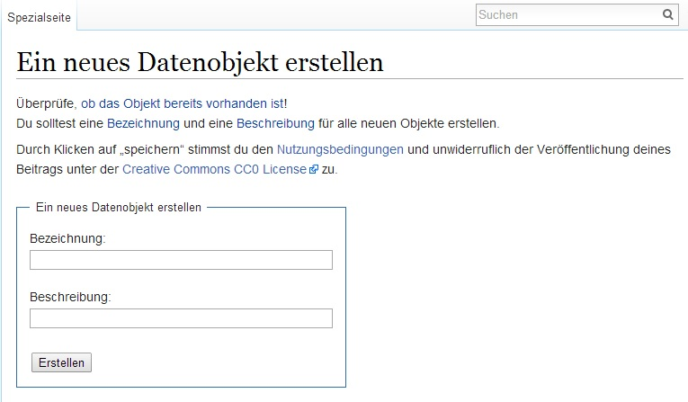

Wenn das Item noch nicht vorhanden ist, erhält man die Möglichkeit ein neues Item zu erstellen. Man wird mit einem Link auf die Erstellungsseite weitergeleitet (s.o. "Die Erstellung eines neuen Items"). Dort muss die Bezeichnung sowie die Beschreibung des zu erstellenden Items eingetragen werden. Ist dies geschehen, kommt man auf die Itemseite.

Auf der Itemseite hat man die Möglichkeit, Änderungen vorzunehmen oder weitere Sprachen beziehungsweise Übersetzungen für die Itembezeichnung hinzuzufügen.

Items bestehen in der Regel aus einer Vielzahl von Aussagen. Diese enthalten Informationen über die reale Welt und sind der Kernteil jedes Items. Sie gliedern sich in Eigenschaften (property) mit vorgegebenem Vokabular und ihnen zugewiesenen Werten beziehungsweise Inhalten. 
In  [Kapitel 4](#bestandteile-von-wikidata) können Sie mehr über die Bestandteile von Items erfahren. Eine Übersicht über alle Eigenschaften von Wikidata kann man in der [Liste der Eigenschaften](https://www.wikidata.org/w/index.php?title=Wikidata:List_of_properties/Summary_table/de&oldid=116061771) finden. Im Anhang dieser Übersicht können Sie überprüfen, welche Werte Sie dort eintragen können.

**Relevanzkriterien**

Zum Erstellen eines Items gibt es drei verschiedene Relevanzkriterien. Es muss erstens einen gültigen Sitelink zu Wikipedia, Wikitravel, Wikisource, Wikiquote oder zu einer Wikimedia Commons-Seite geben. Zweitens muss sich der Artikel auf eine Instanz einer klaren konzeptionellen oder materiellen Einheit beziehen. Der dritte Kriterienpunkt ist, dass das Item eine strukturelle Notwendigkeit hat, um zum Beispiel die Aussagen eines schon bestehenden Items zu erörtern.

### Übersetzungen in Wikidata

Wikidata arbeitet an einem Modell bei dem alle Sprachen beziehungsweise Sprachlinks an einem zentralen Punkt zusammengeführt und verknüpft werden. Auf diese Weise werden alle Wiki-Einträge (in allen Sprachen) an einer zentralen Stelle angezeigt. Es können [Anträge](https://www.wikidata.org/w/index.php?title=Wikidata:Translators%27_noticeboard&oldid=115958854) zur Übersetzung gestellt oder Verbesserungsvorschläge und Rechtschreibkorrekturen angemerkt werden. 

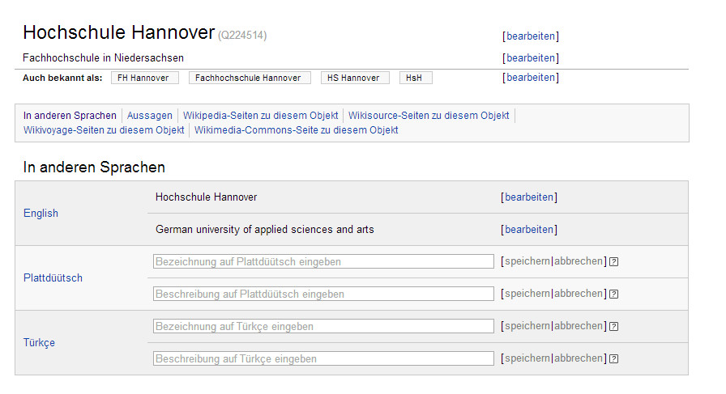

Anderssprachige Bezeichnungen und Beschreibungen von Items können auf der Seite der jeweiligen Items unter "In anderen Sprachen" eingetragen werden. Wie im Screenshot zu sehen ist, werden automatisch die Sprachen Englisch, Plattdeutsch und Türkisch vorgeschlagen. Da es bereits eine englische Übersetzung gibt, kann diese nicht neu angelegt, sondern nur bearbeitet werden. Plattdeutsch und Türkisch haben noch keine Übersetzungen, also kann der Nutzer einfach in das leere Feld die entsprechende Bezeichnung beziehungsweise Beschreibung eintragen. Hierbei ist Vorsicht angeraten, denn beim Übersetzen gibt es [Richtlinien](https://www.wikidata.org/wiki/Help:Sitelinks/de-formal) zu beachten. Es darf nur dann eine Sprache hinzugefügt werden, wenn es dazu auch einen passenden Wikipedia-Artikel in der jeweiligen Sprache gibt. Eine andere Möglichkeit, Sprachen und Übersetzungen auf den Itemseiten zu bearbeiten ist das Helferlein "Liste der Bezeichnungen". 

**Liste der Bezeichnungen**

Für die Anzeige der Liste der Bezeichnungen muss diese zunächst in  in den [Einstellungen](https://www.wikidata.org/wiki/Special:Preferences) (Achtung: Anmeldung erforderlich!) im Reiter "Helferlein" im Punkt "LabelLister" aktiviert werden. Dafür ist eine Anmeldung erforderlich. Wenn dieses Kästchen angehakt ist, erscheint nun auf der Seite des Items ein weiteres Feld zwischen "Lesen" und "Versionsgeschichte", nämlich die "Liste der Bezeichnungen".

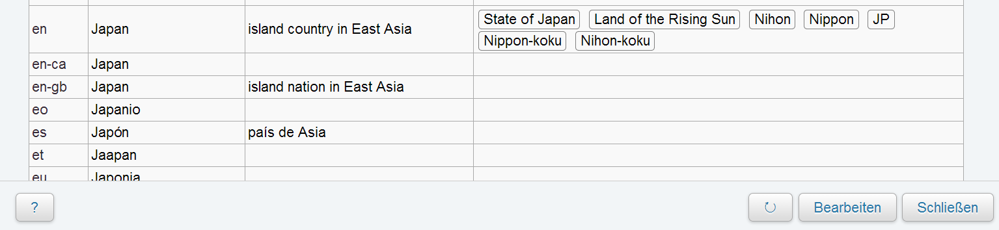

Klickt man nun darauf, erscheint ein PopUp-Fenster, welches alle Übersetzungen der Bezeichnung enthält. Für eine Änderung bzw. Eintragung einer neuen Itembezeichnung und Itembeschreibung müssen Sie "Bearbeiten" im PopUp-Fenster anwählen. Anschließend geben Sie den [Sprachencode](https://de.wikipedia.org/wiki/Wikipedia:Sprachen#Alle_Wikipedias) ein und nach der Eingabe öffnet sich das Bearbeitungsfenster für die Sprachbezeichnungen, Aliasse und Beschreibungen. Nachdem Sie auf "Speichern" geklickt haben, werden die Änderungen auf der Itemseite angezeigt. 

### Aussagen bearbeiten

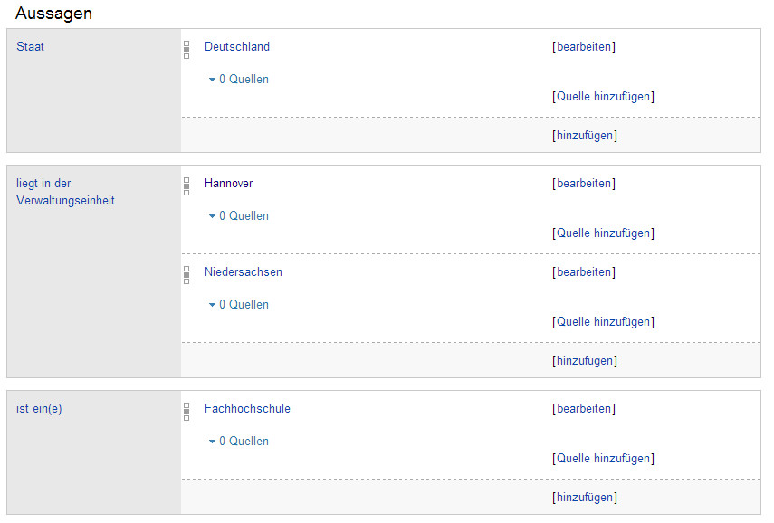

Aussagen lassen sich bei Wikidata auf der Seite des Items bearbeiten und anlegen. Mit einem Klick auf "bearbeiten" (siehe oben), kann man den Wert einer schon bestehenden Eigenschaft bearbeiten. Bei Klicken auf "hinzufügen" ist es möglich, einen neuen Wert zu erstellen. Allerdings können die Begriffe nicht frei gewählt werden, man muss aus einem Pool bereits bestehender und von Wikidata normierten Begriffen auswählen. Im Folgenden ist das Bearbeiten eines Werts erklärt.

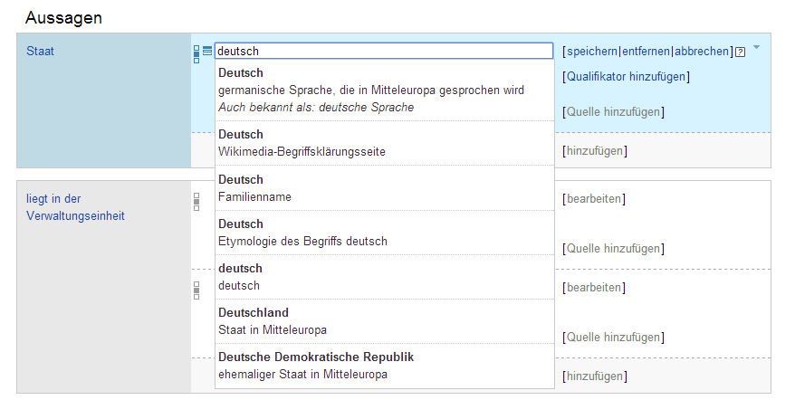

Um eine neue Aussage zu erstellen, muss man auf "hinzufügen" am Ende der Aussagenliste klicken (siehe unten, blaue Umrandung). Auch die Begriffe für die Eigenschaften sind nicht frei wählbar, sie müssen ebenfalls aus einer bestehenden Liste ausgewählt werden.

Wie auf den Screenshots zu sehen ist, können Aussagen zusätzlich mit [Belegen](#belege) versehen werden.

### Neue Eigenschaften vorschlagen

Nur Administratoren und [Eigenschaftenersteller](https://www.wikidata.org/wiki/Wikidata:Property_creators/de) können neue Wikidata-Eigenschaften erstellen. Normale User können eine neue Eigenschaft [vorschlagen](https://www.wikidata.org/wiki/Wikidata:Property_proposal/de) und dieser Vorschlag wird dann geprüft. Bevor Sie aber eine neue Eigenschaft in die Diskussion einbringen, beachten Sie bitte folgendes: 

1. Überprüfen Sie in der [Liste der Eigenschaften](https://www.wikidata.org/wiki/Wikidata:List_of_properties/de), ob die Eigenschaft bereits existiert.
2. Überprüfen Sie, ob die Eigenschaft bereits vorgeschlagen oder abgelehnt wurde.
3. Prüfen Sie, ob Sie der Eigenschaft eine ähnliche Bezeichnung und Beschreibung geben können, wie einem bereits existierenden Infobox-Parameter in der Wikipedia. Sollte dies zutreffen, überlegen Sie, ob deren Daten automatisch nach Wikidata übertragen werden können.
4. Wählen Sie den richtigen Datentyp für die Eigenschaft.
5. Erstellen Sie auf Basis des [Formulars](https://www.wikidata.org/wiki/Wikidata:Property_proposal/all) die Eigenschaftsdokumentation und fügen Sie sie in den passenden Abschnitt ein.

Die neue Eigenschaft wird dann mindestens eine Woche lang diskutiert und wenn es nach dieser Woche keine oder kaum Gegenstimmen gibt, wird die Eigenschaft von einem Administrator oder Eigenschaftenersteller erzeugt.

## Wikidata in anderen Anwendungen weiternutzen

Prinzipiell kann Wikidata direkt als Datenbank zum Nachschlagen von Informationen genutzt werden. Das volle Potential entfalten die Inhalte allerdings erst durch Einbindung in andere Anwendungen. Dank Freigabe unter der [CC0 Lizenz](http://creativecommons.org/publicdomain/zero/1.0/deed.de) ist dies uneingeschränkt möglich. Im Folgenden werden die praktischen Möglichkeiten der Weiternutzung mit besonderem Schwerpunkt auf Normdaten vorgestellt.

### Alternative Benutzeroberflächen

Die Standard-Benutzeroberfläche von Wikidata ist vor allem auf das [Bearbeiten](#aussagen-bearbeiten) von Inhalten ausgelegt. Zum reinen Stöbern in den Datenbeständen ist diese Ansicht eher unübersichtlich. Eine Alternative bieten Benutzeroberflächen und Anwendungen, die Wikidata-Inhalte in ansprechender Form präsentieren. Ein Beispiel hierfür ist die Reasonator-Webanwendung unter
<http://tools.wmflabs.org/reasonator/>.

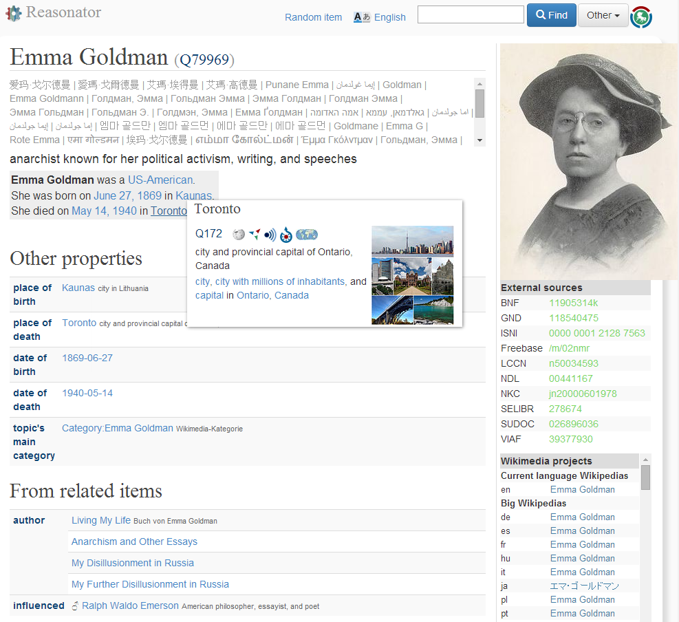

### Zugriff per MediaWiki-API

Wie andere MediaWiki-Installation bietet auch Wikidata die Möglichkeit, Inhalte über eine Schnittstelle abzufragen. Die MediaWiki-API unter <http://wikidata.org/w/api.php> ermöglicht praktisch alle Aktionen, die auch über die Benutzeroberfläche von Wikidata möglich sind (Suche, Bearbeitung...). Diese Möglichkeit wird unter anderem von Bots verwendet, die Inhalte in Wikidata automatisch eintragen oder ergänzen. Zum Zugriff auf die API bietet es sich an, auf vorhandene Programmbibliotheken wie [Pywikibot](http://www.mediawiki.org/wiki/Manual:Pywikibot) oder [Catmandu-Wikidata](https://metacpan.org/release/Catmandu-Wikidata) zurückzugreifen.

Die URL <http://www.wikidata.org/w/api.php?action=wbgetentities&ids=Q17&props=labels&format=json> liefert die Namen von Japan (Item [`Q17`](https://www.wikidata.org/wiki/Q17)) in allen in Wikidata vorhandenen Sprachen im JSON-Format.

### Download der gesamten Datenbank

Für einen vollständigen Zugriff werden unter <http://dumps.wikimedia.org/wikidatawiki/> in regelmäßigen Abständen Abzüge der Wikidata-Datenbank bereitgestellt. Zur Auswertung der Daten sind jedoch aufgrund von Umfang und Datenstruktur weitere Programme wie das [Wikidata Toolkit](https://www.mediawiki.org/wiki/Wikidata_Toolkit) notwendig.

### Komplexere Abfragen und Analysen

Bislang bietet Wikidata noch keine einfache Möglichkeit für komplexere Datenbank-Abfragen, so dass für umfangreichere Analysen im Zweifelsfall die gesamte Datenbank heruntergeladen werden muss. Alternativ dazu gibt es einige Programme mit denen Abfragen an eine möglichst aktuelle Kopie der Wikidata-Datenbank gestellt werden können.

Für die Einbindung in MediaWiki beinhaltet die Wikibase-Software eine [Komponente zur Programmierung von Wikidata-Abfragen in der Programmiersprache Lua](http://www.mediawiki.org/wiki/Extension:Wikibase_Client/Lua). Diese Variante soll zunehmend in den Wikis der Wikimedia-Foundation verwendet werden, um dort Infoboxen, Listen und andere strukturierte Inhalte anzuzeigen. Eine weitere Möglichkeit ist die Webanwendung WikiData Query (WDQ) unter <http://wdq.wmflabs.org/>. Dort können in einer speziellen Abfragesprache und über ein Webinterface Abfragen zusammengestellt werden, beispielsweise um Listen von Wikidata-Items mit gemeinsamen Eigenschaften zu erstellen.

Die Anfrage `string[227:"224028495-5"]` fragt in WikiData Query alle Items ab, die eine Aussage mit der Eigenschaft [`P227`](https://www.wikidata.org/wiki/Property:P227) (GND-Identifier) haben, deren Wert die Zeichenkette "224028495-5" ist. Auf diese Weise kann zu einer GND-Nummer, falls vorhanden, das entsprechende Wikidata-Item nachgeschlagen werden.

### Bereitstellung von Normdaten-Mappings

Die Webanwendung [Wikidata BEACON](http://tools.wmflabs.org/wikidata-todo/beacon.php) ermöglicht die Abfrage von vollständigen Normdaten-Mappings aus Wikidata. Die Mappings werden im [BEACON-Format](http://gbv.github.io/beaconspec/beacon.html) bereitgestellt und bestehen im Wesentlichen aus einer Tabelle die Item-IDs aus Wikidata den entsprechenden IDs einer anderen Normdatei gegenüberstellt.

Ein gekürzter Auszug aus dem Normdaten-Mapping von Wikidata zu GND. Konkret wird hier der URL <http://www.wikidata.org/wiki/Q17> auf die URL <http://d-nb.info/gnd/4028495-5> gemappt, da beide Normdatensätze sich auf Japan beziehen:

    #PREFIX: http://www.wikidata.org/wiki/
    #TARGET: http://d-nb.info/gnd/

    Q17|Japan|4028495-5

# Frequently Asked Questions {.unnumbered}

**1. Stellt Wikidata Doppelarbeit dar, wenn es bereits entsprechende Wikipedia-Artikel gibt?**
Nein, Wikidata übernimmt die Fakten von Wikipedia und bereitet sie auf. Diese können durch die Aussagen leicht in anderen Sprachen abgerufen werden, was in Wikipedia nicht möglich ist.

**2. Warum gibt es ein festes Vokabular für Eigenschaften?** 
Eigenschaften sind in verschiedenen Sprachen vorhanden. Die Begriffe sind vorgegeben, damit eine problemlose Übersetzung ermöglicht wird. Bei fehlenden Begriffen können diese der Community vorgeschlagen werden. Ausführliche Informationen zu diesem Thema finden Sie im Kapitel [Neue Wikidata Eigenschaften](#neue-wikidata-eigenschaften-erstellen).
 
 **3. Wie erzeuge ich ein neues Item?**
Zuerst sollten Sie überprüfen, ob das Item, dass Sie erstellen möchten, möglicherweise bereits existiert. 
Falls das Item nicht vorhanden ist, können Sie das [neue Item erstellen](http://www.wikidata.org/wiki/Special:NewItem?uselang=de). Auf dieser Seite müssen Sie zuerst die Bezeichnung sowie die Beschreibung des zu erstellenden Items eintragen. Ist dies geschehen, kommen sie auf die Itemseite. [Kapitel 6.4.1 Neue Items anlegen](http://hshwd.jakobvoss.de/normdaten-in-wikidata.html#neue-items-anlegen) zeigt Ihnen ausführlich, wie man ein Item anlegen kann. 

**4. Ich suche eine Übersichtsseite zu wichtigen Begriffen von Wikidata. Gibt es so etwas?**
Wikidata besitzt ein ausführliches Glossar, in dem wichtige Begriffe von Wikidata und dessen Funktionsweise beschrieben sind. Sie finden das Glossar auf [dieser Website](http://hshwd.jakobvoss.de/normdaten-in-wikidata.html#glossar "Glossar"). 
 
 **5. Was sind Belege?**
Belege bestehen aus mindestens einer Eigenschaft und einem Wert. Die Eigenschaften, die eine Aussage belegen sollen,  werden aus dem Pool von verfügbaren (und festgelegten) Eigenschaften ausgelegt. Der Wert ist ein Nachweis einer Information, die in einer Aussage verwendet wird, zum Beispiel ein Zitat, eine Website oder ein anderes Dokument, dass die Qualitätssicherung gewährleistet. 
Lesen Sie [Kapitel 4.3.3 Belege](http://hshwd.jakobvoss.de/normdaten-in-wikidata.html#belege "Kapitel 4.3.3 Belege") sowie [Hilfe: Belege](http://www.wikidata.org/wiki/Help:Sources/de "Hilfe: Belege")

**6. Wie finde ich etwas in Wikidata?**
Die beiden wichtigsten Möglichkeiten sind die Suchfunktion (die umfassende Suche über Sprachgrenzen hinweg) und die Suche von [Datenobjekten nach Titeln](http://www.wikidata.org/wiki/Special:ItemByTitle?uselang=de). Letzteres funktioniert indem Sie bei "Website" eine Sprache eines Wikimedia-Projektes ("de" -> "Deutsch (dewiki)") und bei "Seite" die Bezeichnung eines Items ("Japan") eingeben. Sie werden anschließend auf die Item-Seite von Japan weitergeleitet. Wichtig zu beachten ist, dass der Eintrag, den Sie in das Suchfeld eingeben, genau mit der Bezeichnung des Items übereinstimmen muss. 
Eine ausführliche Beschreibung  der Suchfunktionen finden Sie im [Kapitel 6.4 Inhalte finden in Wikidata](http://hshwd.jakobvoss.de/normdaten-in-wikidata.html#inhalte-finden-in-wikidata). 
 

# Glossar {.unnumbered}

**Aussage (statement)**
  : Eine [Aussage](#wikidata-aussagen) ist eine Untereinheit eines Items in Wikidata. Aussagen bestehen in der Regel aus einer normierten Eigenschaft, ihnen zugewiesenen Items und optionalen Belege. Nicht jede Eigenschaft muss als Wert ein Item beinhalten, manche enthalten einfache externe Verlinkungen (Normdaten, Webseiten...) oder einfache Daten (geografische Daten, Ländercodes...). Wikidata gibt keine Auskunft über die Richtigkeit von Aussagen, sondern beschränkt sich auf das Sammeln und die Bereitstellung von Daten, zusammen mit der dem Nachweis der Quelle. 

**Beleg**
  : Ein [Beleg](#belege) in Wikidata ist eine beliebige Literatur- oder Quellenangabe, die eine Aussage bestätigt. Belege können ihrerseits auf andere Items verweisen, beispielsweise auf ein Buch, das in Wikidata einen eigenen Eintrag hat.

**Bot** 
  : Ein [Bot](#einfuehrung-in-wikidata) ist eine selbstständig arbeitende Software, die Bearbeitungen ohne menschliche Entscheidungen vornehmen kann. Bots können Interwikilinks, Bezeichnungen, Beschreibungen, Aussagen, Quellen hinzufügen und bearbeiten. Außerdem können Bots Objekte automatisiert erstellen.  Um mehr Information zu Bots zu finden siehe  <http://www.wikidata.org/wiki/Wikidata:Bots/de>.

**Daten**
  :  [Daten](#inhalte-von-wikidata) in Wikidata sind die Sammlung aller strukturierten Daten und somit der gesamte Bestand der Datenbank. Als Daten gelten alle Datensätze, welche Wikidata-Autoren und Bots in Wikidata erstellen. Der Hauptnamensraum für die Items (Datenobjekte), der Eigenschaftsnamensraum für die Eigenschaften (properties) und der Abfragenamensraum für die Abfragen (queries) bilden die drei Daten-Namensräumen (entitiy namespaces). Andere Wikidataseiten bestehen aus unstrukturiertem Inhalt, beispielsweise Fließtext, und gelten als Metaseiten. Die speziellen Daten der Eigenschaften (property data) sind die Werte (values) in den Aussagen (statements), die ganz bestimmte Datentypen erfordern.

**Datenbank**
  : Eine [Datenbank](#einleitung) dient der Verwaltung großer Datenmengen, damit diese schnell, widerspruchsfrei und dauerhaft gespeichert und für verschiedene Benutzergruppen ausgegeben werden können. 
  
**Datenbestand**
  : Ein [Datenbestand](#wikidata-als-datenbank) stellt die Gesamtheit aller Daten in einer Datenbank dar. In Wikidata ist der Datenbestand die Menge aller Items und Aussagen. 

**Datenobjekt**
  : siehe *Item*

**Datentyp** 
  : Unter [Datentypen](#datentypen-und-andere-einschränkungen) versteht man die Zusammenfassung von Objektmengen. Datentypen haben die Aufgabe zu bestimmen, welche Art von Werten den Eigenschaften zugeordnet werden können. Datentypen, die in Wikidata Installation verfügbar sind: Datenobjekt, Mediendatei auf Commons, Zeichenkette, Zeit, Koordinate, URL und Menge.
  
**Deskriptor** (Synonym: Schlagwort)
  : Ein [Deskriptor](#einführung-in-normdaten) beschreibt den Inhalt eines Dokumentes. Im Allgemeinen werden Deskriptoren aus einem kontrollierten und geordneten Vokabular entnommen (Normdateien, Thesauri oder Klassifikationen). 
  
**Eigenschaft (property)**
  : [Eigenschaften](#wikidata-eigenschaften) sind Bestandteile von Aussagen. Ihnen können Werte (Items) zugeordnet werden. Jede Eigenschaft ist einzigartig und beschreibt die Merkmale der ihnen zugewiesenen Items.  

**Github**
  : Mit Hilfe von Github kann mit verschiedenen Werkzeugen zum Buch beigetragen werden, ohne zu stark an eine Software gebunden zu sein. Die einzelnen Texte sind in Markdown-Syntax verfasst, und werden mit Hilfe des Programms Pandoc in verschiedene Ausgabeformate überführt. Zur Bearbeitung der Texte wurde hauptsächlich die Online-Plattform  Penflip verwendet. Die URL des git-Repositories ist <https://www.penflip.com/nichtich/normdaten-in-wikidata.git>, darüber hinaus gibt es eine Kopie unter <https://github.com/hshdb/normdaten-in-wikidata>. Das Repository enthält die Datei `README.md` die weitere Hinweise zur technischen Umsetzung beinhaltet. Alle Inhalte können unter den Bedingungen der CC-BY-SA Lizenz weiterverwendet werden. 
  
**GND (Gemeinsame Normdatei)**
  : Die [Gemeinsame Normdatei](#einführung-in-normdaten) ist ein Projekt der Deutschen Nationalbibliothek und einigen anderen deutschen Bibliotheken. Sie stellt den Zusammenschluss der ehemaligen getrennten Gemeinsamen Körperschaftsdatei (GKD), der Personennormendatei (PND), der Schlagwortnormdatei (SWD) und der Einheitssachtitel-Datei des Deutschen Musikarchivs (DMA-EST-Datei) dar. 
  
**Item (Datenobjekt)**
  : [Item](#allgemein-zu-wikidata-items) ist ein Eintrag in Wikidata, der sich auf einen Gegenstand (Person, Ort, Konzept) bezieht. Jedes Wikidata-Item hat eine eindeutige ID, die mit `Q` beginnt. Items sind mit anderen Items mit Interwikilinks verknüpft.
  
**Indexierung**
  : Das [Indexieren](#einführung-in-normdaten) beschreibt eine Methode der Inhaltserschließung von Dokumenten und medialen Inhalten jeglicher Art. Produkte von Indexierungen sind Schlagwörter und Stichwörter. Indexierte Dokumente sollen nach einer späteren Recherche mit - nach bestimmten Regeln von Dokumentationssprachen (mithilfe einer Klassifikation oder eines Thesaurus) - genau den vergebenen Schlag- und Stichwörtern wiedergefunden werden. 
  
**Klassifikation**
  : Eine [Klassifikation](#einführung-in-normdaten) ist ein hierarchisches Verzeichnis von Schlagworten, welche nach Wissensgebieten geordnet sind (sogenannte Klassen). Die Ordnung einer Klassifikation erfolgt stets vom allgemeinen zum speziellen. Die Klassifikationsnummern dienen der Suche nach einem speziellen Thema. Klassifikationsnummern bestehen dabei oft aus einem Buchstaben (Wissensgebiet) und einer Zahl (Teilgebiet). 

**Mapping (Konkordanz)**
  : In Bezug auf Normdaten ist ein [Mapping](#einfuehrung-in-normdaten) eine Abbildung von Normdaten aus einer Normdatei auf Normdaten einer anderen Normdatei.

**MediaWiki**
  : [MediaWiki](#wikidata-als-datenbank) ist ein freies Softwarepaket zum Betrieb eines Wikis, das ursprünglich für die Wikipedia geschrieben wurde. Das Wikisystem wird von allen Wikis der Wikimedia-Stiftung (Wikimedia Foundation) betriebenen. 
  
**Metadaten**
  : [Metadaten](#einführung-in-normdaten) sind Daten, welche Eigenschaften und Merkmale anderer Daten beschreiben. Metadaten können am Beispiel eines Buches der Titel, die ISBN, das Erscheinungsjahr, der Verlag und ähnliches sein. Metadaten finden sich in der gesamten digitalen Welt wieder und haben gerade im wissenschaftlichen Bereich eine sehr wichtige Bedeutung.                       

**Normdatei**
  : Eine [Normdatei](#einführung-in-normdaten) ist ein Gesamtverzeichnis aller Normdaten. Viele Länder beziehungsweise, Sprachengebiete haben für ihre Bibliothekssysteme oder auch Datenbestände eigene Normdateien entwickelt, zum Beispiel die GND, LCCN, NDL, VIAF. In Wikidata selbst gibt es zwei Normdateienfunktionen. Wikidata kann externe Normdaten einbinden und soll in Zukunft selbst eine Normdatei für Projekte der Wikimedia Foundation werden. 

**Normdaten**
  : [Normdaten](#einführung-in-normdaten) sind Daten, welche nach festgelegten Regeln erschlossen und beschrieben werden. Normdaten sind stets unter einem einzigartigen Namen zu finden, welcher sich aus alphanumerischen Zeichen zusammensetzt. Manche Normdaten in Wikidata enthalten  Synonyme, Verwandte, Ober-und Unterbegriffe und manchmal auch Beschreibungstexte und Synonyme in anderen Sprachen. Fast alle Daten können normiert werden, wie zum Beispiel Personen, Orte, geografische Einheiten, Körperschaften, Verwaltungseinheiten. Die Beschreibung zur Bildung von Normdaten befindet sich in umfangreichen Regelwerken und Richtlinien. 
  
**Normdaten-Eigenschaft**
  : In Wikidata ist eine Normdaten-Eigenschaft eine *Eigenschaft*, die dazu dient mittels ID oder Notation auf einen Normdatensatz in einer anderen Normdatei zu verweisen.

**Ontologie**
  : Eine [Ontologie](#einführung-in-normdaten) beinhaltet Eigenschaften (properties) in Aussagen (statements). Ontologie wird genutzt, um die beschriebenen Gegenstände der realen Welt in Beziehung zu setzen mit den anderen in Datenobjekten vorhandenen Daten und mit Quellenangaben.
  
**Qualifikator**
  : Ein [Qualifikator](#qualifikatoren) ist Teil einer Behauptung, der etwas über die Behauptung in einer beschreibenden Form ausdrückt. Ein Qualifikator kann ein Ausdruck einer Sprache sein oder eine veränderte Beschreibung der Behauptung.  

**Rang**
  :  Mit [Rängen](#ränge) werden verschiedene Qualitätsstufen für mehrere unterschiedliche Aussagen zu einer gleichen Eigenschaft gekennzeichnet. Es gibt drei Ränge, den herabgestuften beziehungsweise zweifelhaften Rang, den normalen Rang und den vorrangig zu behandelnden Rang. 
  
**Thesaurus**
  : Ein [Thesaurus](#einführung-in-normdaten) ist eine Sammlung von Schlagworten, welche hierarchisch und thematisch miteinander verknüpft sind. Ein Schlagwort in einem Thesaurus beinhaltet Synonyme, verwandte Begriffe (Assoziationen), Ober- und Unterbegriffe. 

**Wikibase**
  : [Wikibase](#wikidata-als-datenbank) ist eine von der Wikimedia-Community entwickelte freie Software-Erweiterung. Wikibase hilft dem Anwender, sein Wiki zu einem strukturierten Datenrepository umzubauen. Zu Wikibase' Kernfunktionen gehören die Erstellung von Items, die Erstellung von Beschreibungen, Benennungen und Alternativnamen für Items. 

# Literaturverzeichnis {.unnumbered}

* Chaosradio Express (2013): CRE205 Wikidata. Online verfügbar unter <http://cre.fm/cre205-wikidata>, zuletzt geprüft am 29.04.2014.
* Hesse, Wolfgang (2002): Ontologien. Herausgegeben von der Gesellschaft für Informatik. Online verfügbar unter <http://www.gi.de/service/informatiklexikon/detailansicht/article/ontologien.html>, zuletzt geprüft am 29.04.2014.
* InfoWissWiki (o.J.): Indexierung. Online verfügbar unter <http://wiki.infowiss.net/Indexierung>, zuletzt geprüft am 29.04.2014.
* Krötzsch, Markus; Vrandečić, Denny (2014): Wikidata: A Free Collaborative Knowledge Base. 
  In: Communications of the ACM (noch nicht erschienen). Online verfügbar unter <http://research.google.com/pubs/archive/42240.pdf>, zuletzt geprüft am 29.04.2014.
* MediaWiki (2014). Online verfügbar unter <https://www.mediawiki.org/wiki/MediaWiki/de>, zuletzt geprüft am 29.04.2014.
* Wikipedia (2014): Wikidata. Online verfügbar unter <http://de.wikipedia.org/wiki/Wikidata>, zuletzt geprüft am 29.04.2014.

## Hilfreiche Seiten in Wikidata {.unnumbered}

* Wikidata-Startseite
<http://wikidata.org>
* Einführung in Wikidata
  <https://www.wikidata.org/wiki/Wikidata:Introduction/de>
* Liste der Wikidata-Eigenschaften
<https://www.wikidata.org/wiki/Wikidata:List_of_properties/de>
* Wikidata Schritt für Schritt bearbeiten
<http://upload.wikimedia.org/wikipedia/commons/9/94/How_to_Edit_Wikidata.pdf>
* Wikidata-Hilfeseite
  <https://www.wikidata.org/w/index.php?title=Help:Contents/de&oldid=66338607&uselang=de>
* Hilfe: Ranking
<https://www.wikidata.org/wiki/Help:Ranking?uselang=de>
* Hilfe: Belege
<http://www.wikidata.org/wiki/Help:Sources/de>
* Wikidata: Liste der Projektregeln und Richtlinien
<https://www.wikidata.org/w/index.php?title=Wikidata:List_of_policies_and_guidelines/de&oldid=102532266>
* Universal Language Selector
<https://www.mediawiki.org/wiki/Universal_Language_Selector?setlang=de>
* Das Datenmodell der Wikibase
<https://www.mediawiki.org/wiki/Wikibase/DataModel>
* Weitere Projekte von Wikimedia
<http://de.wikipedia.org/w/index.php?title=Wikipedia:Schwesterprojekte&oldid=127371039>

# Liste aller Normdaten-Eigenschaften {.unnumbered}

Die folgende Liste wurde automatisch erstellt und stellt den Stand zum XXXX
dar. Zu diesem Zeitpunkt hatte Wikidata insgesamt Y Normdaten-Eigenschaften.

id | Name | Beschreibung
---|------|-------------
[`P212`](https://www.wikidata.org/wiki/Property:P212) | ISBN-13 | Internationale Standardbuchnummer (Vorgänger: ISBN-10, s. P957)
[`P213`](https://www.wikidata.org/wiki/Property:P213) | ISNI | International Standard Name Identifier (Eingabe mit Leerzeichen. Beispiel: 0000 0001 0886 1508.)
[`P214`](https://www.wikidata.org/wiki/Property:P214) | VIAF | virtuelle internationale Normdatei für Personendaten (bitte nur individualisierte VIAFs eintragen, d.h. Nummern ohne den Vermerk "undifferentiated")
[`P215`](https://www.wikidata.org/wiki/Property:P215) | Spektralklasse | Klassifizierung astronomischer Objekte nach dem Spektrum
[`P218`](https://www.wikidata.org/wiki/Property:P218) | ISO 639-1 | Kennung für Namen von Sprachen von der Internationalen Organisation für Normung
[`P219`](https://www.wikidata.org/wiki/Property:P219) | ISO 639-2 | Kennung für Namen von Sprachen von der Internationalen Organisation für Normung
[`P220`](https://www.wikidata.org/wiki/Property:P220) | ISO 639-3 | Kennung für Namen von Sprachen von der Internationalen Organisation für Normung
[`P225`](https://www.wikidata.org/wiki/Property:P225) | wissenschaftlicher Name | wissenschaftliche Benennung des Lebewesens
[`P227`](https://www.wikidata.org/wiki/Property:P227) | GND-Nummer | internationale Normdatei für Personennamen, Körperschaften und Schlagworte (bitte nicht Typ n eintragen = Name, mehrdeutig)
[`P231`](https://www.wikidata.org/wiki/Property:P231) | CAS-Nummer | internationaler Bezeichnungsstandard für chemische Stoffe
[`P232`](https://www.wikidata.org/wiki/Property:P232) | EINECS-Nummer | Altstoffverzeichnis der EU
[`P233`](https://www.wikidata.org/wiki/Property:P233) | SMILES | chemischer Strukturcode
[`P234`](https://www.wikidata.org/wiki/Property:P234) | InChI | Internationale chemische Bezeichnung der IUPAC
[`P235`](https://www.wikidata.org/wiki/Property:P235) | InChIKey | Eine vom InChI Code einer chemischen Verbindungen abgeleitete, 25 Zeichen lange, aus Buchstaben (14 + 10) sowie einem Bindestrich bestehende Zeichenkette zur 'eindeutigen' Kennzeichnung der Substanz.
[`P236`](https://www.wikidata.org/wiki/Property:P236) | ISSN | Internationale Standardnummer für fortlaufende Sammelwerke
[`P238`](https://www.wikidata.org/wiki/Property:P238) | IATA-Flughafencode | alphanumerischer Code für Flughäfen
[`P239`](https://www.wikidata.org/wiki/Property:P239) | ICAO-Flughafencode | alphanumerischer Code für Flughäfen
[`P243`](https://www.wikidata.org/wiki/Property:P243) | OCLC | OCLC-Nummer in WorldCat
[`P244`](https://www.wikidata.org/wiki/Property:P244) | LCNAF | Normdatensatz der Library of Congress (für einzelne Bücher siehe P1144)
[`P245`](https://www.wikidata.org/wiki/Property:P245) | ULAN | Identifikationsnummer in der Union List of Artist Names
[`P246`](https://www.wikidata.org/wiki/Property:P246) | Elementsymbol | Kurzschreibweise für einzelne Atome eines chemischen Elements
[`P247`](https://www.wikidata.org/wiki/Property:P247) | COSPAR-Bezeichnung | Katalognummer eines Raumflugkörpers auf einer Umlaufbahn
[`P267`](https://www.wikidata.org/wiki/Property:P267) | ATC-Code | Code des Anatomisch-Therapeutisch-Chemischen Klassifikationssystems
[`P268`](https://www.wikidata.org/wiki/Property:P268) | BnF | Normdateneintrag in der französischen Nationalbibliothek
[`P269`](https://www.wikidata.org/wiki/Property:P269) | SUDOC Normdaten | Normdateneintrag im gleichnamigen französischen Bibliotheksverbund (s. auch P1025)
[`P270`](https://www.wikidata.org/wiki/Property:P270) | CALIS | Normdateneintrag im gleichnamigen chinesischen Bibliotheksverbund
[`P271`](https://www.wikidata.org/wiki/Property:P271) | CiNii Normdaten | Normdateneintrag im gleichnamigen japanischen Verbundkatalog
[`P278`](https://www.wikidata.org/wiki/Property:P278) | GOST 7.75-97 | Sprachencode
[`P300`](https://www.wikidata.org/wiki/Property:P300) | ISO 3166-2 Code | aus Ländercode und ein- bis dreistelligem alphanummerischem Code für subnationale Einheiten
[`P303`](https://www.wikidata.org/wiki/Property:P303) | EE-Nummer | Objekt ist ein Bezeichner der EE-Liste der Rassetauben (ELRT)
[`P345`](https://www.wikidata.org/wiki/Property:P345) | IMDb-Identifikationsnummer | Identifikationsnummer in der Internet Movie Database (IMDb) inklusive Präfix (tt-, nm-, ch-, co-)
[`P347`](https://www.wikidata.org/wiki/Property:P347) | Joconde | ID in der Joconde-Datenbank des französischen Kulturministeriums
[`P349`](https://www.wikidata.org/wiki/Property:P349) | Web NDL Authorities | Normdateneintrag in der Nationalen Parlamentsbibliothek (NDL), Japan
[`P350`](https://www.wikidata.org/wiki/Property:P350) | RKD-Werk-ID | Identifikationsnummer in der Datenbank des Niederländischen Instituts für Kunstgeschichte (Rijksbureau voor Kunsthistorische Documentatie)
[`P351`](https://www.wikidata.org/wiki/Property:P351) | Entrez-Gene-Nummer | Identifikationsnummer in der Entrez-Gene-Datenbank
[`P352`](https://www.wikidata.org/wiki/Property:P352) | UniProt-ID | Identifikationsnummer in der UniProt-Datenbank
[`P353`](https://www.wikidata.org/wiki/Property:P353) | Gen-Symbol | Offizielles Gen-Symbol
[`P354`](https://www.wikidata.org/wiki/Property:P354) | HGNC-ID | Gene-ID aus der Datenbank HGNC
[`P356`](https://www.wikidata.org/wiki/Property:P356) | DOI | digitaler Identifikator für physische, digitale oder abstrakte Objekte
[`P359`](https://www.wikidata.org/wiki/Property:P359) | Rijksmonument-Nummer | Identifikationsnummer von Rijksmonumenten, vergeben vom Rijksdienst voor het Cultureel Erfgoed
[`P373`](https://www.wikidata.org/wiki/Property:P373) | Commons-Kategorie | Name der Kategorie auf Wikimedia Commons, welche Dateien zu dem Objekt (item) beinhaltet (ohne das Präfix "Category")
[`P374`](https://www.wikidata.org/wiki/Property:P374) | INSEE-Gemeindecode | Schlüssel für französische Gemeinden
[`P377`](https://www.wikidata.org/wiki/Property:P377) | SCN | Satellite Catalog Number
[`P380`](https://www.wikidata.org/wiki/Property:P380) | Mérimée-Kennzeichnung | Identifikator für die französischen Kulturdenkmäler-Datenbank Mérimée
[`P381`](https://www.wikidata.org/wiki/Property:P381) | KGS-DS-Nummer | Identifizierungsnummer des Kulturgüterschutzes in der Schweiz
[`P382`](https://www.wikidata.org/wiki/Property:P382) | CBS-Code | vierstelliger niederländischer Ortscode des Centraal Bureau voor de Statistiek
[`P395`](https://www.wikidata.org/wiki/Property:P395) | Kfz-Kennzeichen | international: Kfz-Nationalitätszeichen oder Kennzeichnung für Fahrzeuge in internationalem Verkehr. Innerstaatlich: Unterscheidungszeichen für den Verwaltungsbezirk
[`P396`](https://www.wikidata.org/wiki/Property:P396) | SBN | Normdatennummer der Italienischen Nationalbibliothek
[`P402`](https://www.wikidata.org/wiki/Property:P402) | OpenStreetMap-Relation-ID | ID des geographischen Objekts in OpenStreetMap
[`P409`](https://www.wikidata.org/wiki/Property:P409) | NLA | Normdatennummer der Australischen Nationalbibliothek
[`P424`](https://www.wikidata.org/wiki/Property:P424) | Wikimedia-Sprachcode | Kürzel der Sprache, wie es in den Wikimedia-Projekten verwendet wird
[`P428`](https://www.wikidata.org/wiki/Property:P428) | botanisches Autorenkürzel gemäß IPNI | offizielle Abkürzung des Subjekts Namen, wenn in der Taxonomie verwendet
[`P434`](https://www.wikidata.org/wiki/Property:P434) | MusicBrainz-Künstler-ID | ID des Künstlers (Musiker, Schriftsteller) in MusicBrainz
[`P435`](https://www.wikidata.org/wiki/Property:P435) | MusicBrainz-Werk-ID | ID des Werkes in MusicBrainz
[`P436`](https://www.wikidata.org/wiki/Property:P436) | MusicBrainz-Veröffentlichungsgruppen-ID | ID der Veröffentlichungsgruppe (vor allem Alben) in MusicBrainz
[`P439`](https://www.wikidata.org/wiki/Property:P439) | Amtlicher Gemeindeschlüssel | für kreisfreie Städte und Kommunen in Deutschland
[`P442`](https://www.wikidata.org/wiki/Property:P442) | chinesischer Code für Verwaltungseinheiten | vergeben vom staatlichen Amt für Statistik der Volksrepublik China
[`P464`](https://www.wikidata.org/wiki/Property:P464) | NOR | französischer Identifikationscode für amtliche Texte
[`P477`](https://www.wikidata.org/wiki/Property:P477) | Historic-Places-ID | Identifikationsnummer im Canadian Register of Historic Places
[`P481`](https://www.wikidata.org/wiki/Property:P481) | Palissy-ID | Identifikator für die französischen Kulturdenkmäler-Datenbank Palissy
[`P486`](https://www.wikidata.org/wiki/Property:P486) | MeSH-ID | Primärschlüssel der Medical-Subject-Headings-Datenbank
[`P490`](https://www.wikidata.org/wiki/Property:P490) | provisorischer Name | Benennung von Asteroiden und Kometen unmittelbar nach ihrer Entdeckung, vor der Vergabe des dauerhaften Namens durch die Internationale Astronomische Union
[`P492`](https://www.wikidata.org/wiki/Property:P492) | OMIM-ID | Identifikationsnummer in der Gen-Datenbank Online Mendelian Inheritance in Man
[`P493`](https://www.wikidata.org/wiki/Property:P493) | ICD-9 | Internationale statistische Klassifikation der Krankheiten – Version 9
[`P494`](https://www.wikidata.org/wiki/Property:P494) | ICD-10 | Internationale statistische Klassifikation der Krankheiten und verwandter Gesundheitsprobleme, 10. Revision
[`P496`](https://www.wikidata.org/wiki/Property:P496) | ORCID | alphanumerischer Code zur Identifizierung wissenschaftlicher Autoren
[`P498`](https://www.wikidata.org/wiki/Property:P498) | Währungscode (ISO 4217) | Norm für Währungs-Abkürzungen von der Internationalen Organisation für Normung
[`P502`](https://www.wikidata.org/wiki/Property:P502) | HURDAT-Kennung | Identifikationsnummer in der North Atlantic hurricane database
[`P506`](https://www.wikidata.org/wiki/Property:P506) | ISO 15924 | Code für Schriftsysteme
[`P508`](https://www.wikidata.org/wiki/Property:P508) | BNCF | bibliographischer Eintrag der italienischen Nationalbibliothek
[`P528`](https://www.wikidata.org/wiki/Property:P528) | Katalognummer | Bezeichnung in einem Katalog
[`P535`](https://www.wikidata.org/wiki/Property:P535) | Find a Grave | Identifikationsnummer in der Begräbnisstätten-Datenbank "Find a Grave"
[`P536`](https://www.wikidata.org/wiki/Property:P536) | ATP-Kennung | Identifikator für Tennisspieler in der Datenbank der ATP
[`P539`](https://www.wikidata.org/wiki/Property:P539) | Museofile | Primärschlüssel der Datenbank des französischen Kulturministeriums
[`P549`](https://www.wikidata.org/wiki/Property:P549) | MGP-ID | Identifikationsnummer in der Mathematiker-Datenbank des Mathematics Genealogy Project
[`P553`](https://www.wikidata.org/wiki/Property:P553) | Nutzerkonto in sozialem Netzwerk | zusammen mit Property:P554 zu verwenden
[`P557`](https://www.wikidata.org/wiki/Property:P557) | DiseasesDB-ID | Kennung in der Diseases Database (diseasesdatabase.com)
[`P563`](https://www.wikidata.org/wiki/Property:P563) | ICD-O | medizinische Klassifikation für die Onkologie
[`P586`](https://www.wikidata.org/wiki/Property:P586) | IPNI-Autor-ID | Identifikator für eine Person im International Plant Names Index (IPNI)
[`P587`](https://www.wikidata.org/wiki/Property:P587) | MMSI | Rufnummer des mobilen Seefunkdienstes
[`P590`](https://www.wikidata.org/wiki/Property:P590) | GNIS | Identifikationsnummer im Geographic Names Information System der Vereinigten Staaten
[`P592`](https://www.wikidata.org/wiki/Property:P592) | ChEMBL | Kennung in der chemischen/biologischen Datenbank ChEMBL
[`P593`](https://www.wikidata.org/wiki/Property:P593) | HomoloGene-ID | Identifikationsnummer in der Datenbank von HomoloGene des National Center for Biotechnology Information
[`P594`](https://www.wikidata.org/wiki/Property:P594) | Ensembl-ID | Identifikationsnummer in der Datenbank des bioinformatisches Forschungsprojekts Ensembl
[`P597`](https://www.wikidata.org/wiki/Property:P597) | WTA-Kennung | Identifikator für Tennisspielerinnen in der Datenbank der WTA
[`P599`](https://www.wikidata.org/wiki/Property:P599) | ITF-ID | Kennung eines Tennisspielers auf der ITF-Webseite
[`P600`](https://www.wikidata.org/wiki/Property:P600) | Wine AppDB-Identifikationsnummer | ID in der Winehq Applikations-Datenbank
[`P604`](https://www.wikidata.org/wiki/Property:P604) | MedlinePlus-ID | frei zugängliche Datenbank von Krankheitsbeschreibungen
[`P613`](https://www.wikidata.org/wiki/Property:P613) | OS-Planquadrat | auf Karten des britischen Ordnance Survey verwendetes Koordinatensystem (National Grid)
[`P627`](https://www.wikidata.org/wiki/Property:P627) | IUCN-ID | Referenz für IUCN Artenschutzstatus (P141)
[`P628`](https://www.wikidata.org/wiki/Property:P628) | E-Nummer | Nummer für Lebensmittelzusätze, die in der EU legal sind
[`P630`](https://www.wikidata.org/wiki/Property:P630) | Straßen-ID der Stadt Paris | digitale Kennung für Straßen in Paris
[`P633`](https://www.wikidata.org/wiki/Property:P633) | Répertoire du patrimoine culturel du Québec | Identifikationsnummer im Verzeichnis des kulturellen Erbes von Quebec
[`P635`](https://www.wikidata.org/wiki/Property:P635) | ISTAT-ID | vom staatlichen italienischen Statistikamt vergebene Identifikationsnummer für Gemeinden
[`P637`](https://www.wikidata.org/wiki/Property:P637) | Protein-ID | Protein Kennzeichnung
[`P638`](https://www.wikidata.org/wiki/Property:P638) | PDB-ID | 3D-Strukturdaten für Gene in der PDB-Datenbank
[`P639`](https://www.wikidata.org/wiki/Property:P639) | RNA-ID | RNA Kennzeichnung
[`P640`](https://www.wikidata.org/wiki/Property:P640) | Léonore-ID | Identifikationsnummer einer Person in der Léonore-Datenbank
[`P643`](https://www.wikidata.org/wiki/Property:P643) | Genloc Chr | Chromosom-Nummer
[`P646`](https://www.wikidata.org/wiki/Property:P646) | Freebase-ID | Kennung des gleichbedeutenden Eintrags in der Freebase-Datenbank
[`P648`](https://www.wikidata.org/wiki/Property:P648) | Open-Library-ID | numerische Buch-Kennung für Werke ("W"), einzelne Ausgaben ("M") und Autoren ("A")
[`P649`](https://www.wikidata.org/wiki/Property:P649) | NRHP | Identifikationsnummer im National Register of Historic Places des US-amerikanischen National Park Service
[`P650`](https://www.wikidata.org/wiki/Property:P650) | RKD-Künstler-ID | Identifikationsnummer in der Datenbank des Niederländischen Instituts für Kunstgeschichte (Rijksbureau voor Kunsthistorische Documentatie)
[`P651`](https://www.wikidata.org/wiki/Property:P651) | BPN | Identifikationsnummer in der Datenbank des niederländischen Biografisch Portaal
[`P652`](https://www.wikidata.org/wiki/Property:P652) | UNII | von der FDA definierter Identifikator für einzelne Inhaltsstoff chemischer Verbindungen
[`P653`](https://www.wikidata.org/wiki/Property:P653) | PubMed-Health | Identifikator für die PubMed-Health-Seite, die Artikel über medizinische Themen bereitstellt
[`P657`](https://www.wikidata.org/wiki/Property:P657) | RTECS-Nummer | Identifikationsnummer in der Registry of Toxic Effects of Chemical Substances (Datenbank toxikologischer Informationen)
[`P661`](https://www.wikidata.org/wiki/Property:P661) | ChemSpider-ID | Datenbank chemischer Verbindungen
[`P662`](https://www.wikidata.org/wiki/Property:P662) | PubChem-ID (CID) | Datenbank von chemischen Verbindungen
[`P665`](https://www.wikidata.org/wiki/Property:P665) | KEGG ID | Datenbanken, die sich mit Genomen, enzymatische Wege und biologische Chemie beschäfftigt
[`P668`](https://www.wikidata.org/wiki/Property:P668) | GeneReviews-ID | Kennung in der GeneReviews-Datenbank
[`P671`](https://www.wikidata.org/wiki/Property:P671) | Mouse Genome Informatics ID | Kennung in der Datenbank Mouse Genome Informatics
[`P672`](https://www.wikidata.org/wiki/Property:P672) | MeSH Code | Medical Subject Headings (MeSH)-Codes sind ein Index und Thesaurus für die Lebenswissenschaften (≠ MeSH ID)
[`P673`](https://www.wikidata.org/wiki/Property:P673) | eMedicine | 
[`P675`](https://www.wikidata.org/wiki/Property:P675) | Google Books | Kennung in der Google-Books-Datenbank
[`P677`](https://www.wikidata.org/wiki/Property:P677) | ÚSOP-Code | von drusop.nature.cz
[`P683`](https://www.wikidata.org/wiki/Property:P683) | ChEBI-ID | Moleküldatenbank und -ontologie
[`P685`](https://www.wikidata.org/wiki/Property:P685) | NCBI-ID | Identifikator in der taxonomischen Datenbank des National Center for Biotechnology Information (NCBI)
[`P686`](https://www.wikidata.org/wiki/Property:P686) | Gene-Ontology-Identifikator | ID in der Gene-Ontology-Datenbank
[`P687`](https://www.wikidata.org/wiki/Property:P687) | BHL-Seiten-ID | Identifikator einer Seite in der Biodiversity Heritage Library (BHL)
[`P691`](https://www.wikidata.org/wiki/Property:P691) | NKCR | Datenbanklink zum Portal der Nationalbibliothek der Tschechischen Republik
[`P698`](https://www.wikidata.org/wiki/Property:P698) | PubMed-ID (PMID) | Identifikator für Artikel in der PubMed-Datenbank
[`P699`](https://www.wikidata.org/wiki/Property:P699) | Disease-Ontology-ID | Kennung in der Disease-Ontology-Datenbank
[`P701`](https://www.wikidata.org/wiki/Property:P701) | Dodis-Nummer | Kennung in der Dodis-Datenbank (Diplomatische Dokumente der Schweiz 1945-1969)
[`P704`](https://www.wikidata.org/wiki/Property:P704) | Ensembl-Transkript-Identifikator | 
[`P705`](https://www.wikidata.org/wiki/Property:P705) | Ensembl-Protein-Identifikator | 
[`P709`](https://www.wikidata.org/wiki/Property:P709) | Historic-Scotland-ID | 
[`P715`](https://www.wikidata.org/wiki/Property:P715) | Drugbank-ID | Kennung in der Drugbank-Datenbank
[`P716`](https://www.wikidata.org/wiki/Property:P716) | JPL Small-Body Database ID | Kennung in der Datenbank JPL Small-Body Database
[`P717`](https://www.wikidata.org/wiki/Property:P717) | *Minor Planet Center observatory code* | 
[`P718`](https://www.wikidata.org/wiki/Property:P718) | Canmore-ID | 
[`P721`](https://www.wikidata.org/wiki/Property:P721) | OKATO-ID | Code im Klassifizierungsschlüssel administrativer Objekte in Russland
[`P722`](https://www.wikidata.org/wiki/Property:P722) | UIC internationale Bahnhofsnummer | UIC internationale Bahnhofsnummer
[`P723`](https://www.wikidata.org/wiki/Property:P723) | DBNL-ID | 
[`P724`](https://www.wikidata.org/wiki/Property:P724) | Internet-Archive-ID | eindeutige Identifikationsnummer eines Datenobjekts auf archive.org
[`P727`](https://www.wikidata.org/wiki/Property:P727) | Europeana-ID | europäische virtuelle Bibliothek
[`P731`](https://www.wikidata.org/wiki/Property:P731) | Litholex Primärschlüssel | Lithostratigraphische Datenbank für Deutschland und gewartet von der BGR
[`P732`](https://www.wikidata.org/wiki/Property:P732) | BGS-Lexikon-ID | Identifikator im lithostratigraphischen Lexikon der britischen geologischen Bundesanstalt
[`P733`](https://www.wikidata.org/wiki/Property:P733) | DINOloket | Datenbank der niederländischen geologischen Einheiten (Data Informatie Nederlandse Ondergrond)
[`P745`](https://www.wikidata.org/wiki/Property:P745) | PBB-ID | Plattdeutsche Biblio- und Biographie
[`P758`](https://www.wikidata.org/wiki/Property:P758) | Kulturminne identifier | Kennung in der Kulturminne-Datenbank der Riksantikvaren
[`P759`](https://www.wikidata.org/wiki/Property:P759) | *Alberta Register of Historic Places identifier* | 
[`P764`](https://www.wikidata.org/wiki/Property:P764) | OKTMO-ID | Code im Klassifizierungsschlüssel munizipaler Gebilde in Russland
[`P771`](https://www.wikidata.org/wiki/Property:P771) | Gemeindenummer in der Schweiz | Nummer des Bundesamtes für Statistik (BFS) in der Schweiz
[`P774`](https://www.wikidata.org/wiki/Property:P774) | FIPS 55-3 (Orte in USA) | 
[`P782`](https://www.wikidata.org/wiki/Property:P782) | LAU | staatliche administrative Hierarchieebene, EU (ehemals NUTS-4 und NUTS-5)
[`P791`](https://www.wikidata.org/wiki/Property:P791) | ISIL-ID | Internationale Kennung für Bibliotheken und verwandte Organisationen
[`P804`](https://www.wikidata.org/wiki/Property:P804) | GNIS-Antarctica-ID | Identifikationsnummer in der Antarktika-Datenbank des GNIS
[`P806`](https://www.wikidata.org/wiki/Property:P806) | italienische Kataster-ID | 
[`P808`](https://www.wikidata.org/wiki/Property:P808) | *code Bien de Interés Cultural* | 
[`P809`](https://www.wikidata.org/wiki/Property:P809) | WDPA-ID | Nummer in der Weltdatenbank über geschützte Gebiete (World Database on Protected Areas)
[`P815`](https://www.wikidata.org/wiki/Property:P815) | ITIS-TSN | die vom Integrated Taxonomic Information System (ITIS) vergebene Taxonomic Serial Number (TSN)
[`P818`](https://www.wikidata.org/wiki/Property:P818) | arXiv ID | Identificationsqode im ArXive-Archiv
[`P819`](https://www.wikidata.org/wiki/Property:P819) | *ADS bibcode* | 
[`P821`](https://www.wikidata.org/wiki/Property:P821) | *CGNDB Unique Identifier* | 
[`P824`](https://www.wikidata.org/wiki/Property:P824) | Meteoritical-Bulletin-Identifikator | 
[`P827`](https://www.wikidata.org/wiki/Property:P827) | *BBC program identifier* | 
[`P829`](https://www.wikidata.org/wiki/Property:P829) | OEIS-ID | Enzyklopädie der Integer-Sequenzen
[`P830`](https://www.wikidata.org/wiki/Property:P830) | EOL-ID | Identifikator in der Encyclopedia of Life (EOL)
[`P838`](https://www.wikidata.org/wiki/Property:P838) | BioLib-ID | Identifikator in der Biological Library (BioLib)
[`P839`](https://www.wikidata.org/wiki/Property:P839) | IMSLP-ID | Identifikationsnummer des Internationalen Notenbibliothek-Projekts
[`P842`](https://www.wikidata.org/wiki/Property:P842) | Fossilworks-ID | Identifikator für fossile Tiere, Pflanzen, und Mikroorganismen
[`P843`](https://www.wikidata.org/wiki/Property:P843) | SIRUTA Code | 
[`P845`](https://www.wikidata.org/wiki/Property:P845) | Sawkatchewan'sches Kulturgüterverzeichnis | 
[`P846`](https://www.wikidata.org/wiki/Property:P846) | GBIF-ID | Identifikator bei der Global Biodiversity Information Facility (GBIF)
[`P850`](https://www.wikidata.org/wiki/Property:P850) | WoRMS-ID | Kennung im World Register of Marine Species
[`P858`](https://www.wikidata.org/wiki/Property:P858) | ESPN SCRUM ID | Identifikation internationaler Rugby-Spieler von der website www.espnscrum.com
[`P860`](https://www.wikidata.org/wiki/Property:P860) | *e-archiv.li ID* | 
[`P861`](https://www.wikidata.org/wiki/Property:P861) | premiershiprugby.com ID | 
[`P863`](https://www.wikidata.org/wiki/Property:P863) | *InPhO identifier * | 
[`P864`](https://www.wikidata.org/wiki/Property:P864) | *ACM Digital Library author identifier* | 
[`P865`](https://www.wikidata.org/wiki/Property:P865) | BMLO | 
[`P866`](https://www.wikidata.org/wiki/Property:P866) | Perlentaucher | Deeplinks auf das gleichnamige Onlinemagazin für Literatur und Kultur
[`P867`](https://www.wikidata.org/wiki/Property:P867) | ROME-Berufscode | ROME-Code für einen Beruf, mit einem Buchstaben und vier Nummern
[`P882`](https://www.wikidata.org/wiki/Property:P882) | FIPS 6-4 (counties in USA) | 
[`P884`](https://www.wikidata.org/wiki/Property:P884) | Russische Gewässerkennzahl | 
[`P886`](https://www.wikidata.org/wiki/Property:P886) | *LIR* | 
[`P888`](https://www.wikidata.org/wiki/Property:P888) | JSTOR | 
[`P889`](https://www.wikidata.org/wiki/Property:P889) | *Mathematical Reviews identifier* | 
[`P892`](https://www.wikidata.org/wiki/Property:P892) | RFC | 
[`P893`](https://www.wikidata.org/wiki/Property:P893) | *Social Science Research Network ID* | 
[`P902`](https://www.wikidata.org/wiki/Property:P902) | Artikelnummer im HLS | Identifikationsnummer im Historischen Lexikon der Schweiz
[`P906`](https://www.wikidata.org/wiki/Property:P906) | SELIBR | Normdatei des schwedischen Verbundkatalogs LIBRIS
[`P907`](https://www.wikidata.org/wiki/Property:P907) | AMG Spiele ID | 
[`P909`](https://www.wikidata.org/wiki/Property:P909) | *Nova Scotia Register of Historic Places identifier* | 
[`P911`](https://www.wikidata.org/wiki/Property:P911) | Südafrikanischer Gemeinde-Code | 
[`P920`](https://www.wikidata.org/wiki/Property:P920) | *Spanish subject headings for public libraries* | 
[`P933`](https://www.wikidata.org/wiki/Property:P933) | *heritagefoundation.ca ID* | 
[`P935`](https://www.wikidata.org/wiki/Property:P935) | Commons-Galerie | Name der Galerieseite(n) auf Wikimedia Commons mit Dateien zu dem Objekt (item)
[`P938`](https://www.wikidata.org/wiki/Property:P938) | FishBase-ID | Identifikator bei FishBase
[`P939`](https://www.wikidata.org/wiki/Property:P939) | KSH Code | 
[`P946`](https://www.wikidata.org/wiki/Property:P946) | ISIN | International Securities Identification Number
[`P947`](https://www.wikidata.org/wiki/Property:P947) | RSL | Normdatennummer der Russischen Staatsbibliothek (RSL)
[`P949`](https://www.wikidata.org/wiki/Property:P949) | NLI (Israel) | Normdatei der Israelischen Nationalbibliothek (National Library of Israel)
[`P950`](https://www.wikidata.org/wiki/Property:P950) | BNE | Normdatei der Spanischen Nationalbibliothek (Biblioteca Nacional de España)
[`P951`](https://www.wikidata.org/wiki/Property:P951) | NSZL | Normdatei der Széchényi-Nationalbibliothek (Ungarn)
[`P957`](https://www.wikidata.org/wiki/Property:P957) | ISBN-10 | Internationale Standardbuchnummer (Nachfolger: ISBN-13, s. P212)
[`P959`](https://www.wikidata.org/wiki/Property:P959) | MSW-ID | Identifikator in der taxonomische Datenbank für Säugetiere Mammal Species of the World
[`P960`](https://www.wikidata.org/wiki/Property:P960) | Tropicos-ID | Identifikator für einen wissenschaftlichen Namen eines Taxons bei Tropicos
[`P961`](https://www.wikidata.org/wiki/Property:P961) | IPNI-TaxonName-ID | Identifikator für den wissenschaftlichen Namen eines Taxons im International Plant Names Index (IPNI)
[`P962`](https://www.wikidata.org/wiki/Property:P962) | MycoBank-ID | Identifikator für den wissenschaftlichen Namen eines Taxons bei der MycoBank
[`P964`](https://www.wikidata.org/wiki/Property:P964) | Gemeindekennziffer in Österreich | Ziffernfolge zur Identifizierung politischer Gemeinden in Österreich
[`P966`](https://www.wikidata.org/wiki/Property:P966) | MusicBrainz-Label-ID | Identifikationsnummer des Labels in der Musikdatenbank MusicBrainz
[`P982`](https://www.wikidata.org/wiki/Property:P982) | MusicBrainz-Gebiets-ID | Identifikationsnummer des Gebiets in der Musikdatenbank MusicBrainz
[`P998`](https://www.wikidata.org/wiki/Property:P998) | dmoz | Open Directory Project
[`P1003`](https://www.wikidata.org/wiki/Property:P1003) | NLR (Rumänien) | Normdatei der Rumänischen Nationalbibliothek (Biblioteca Națională a României)
[`P1004`](https://www.wikidata.org/wiki/Property:P1004) | MusicBrainz-Location-ID | Identifikationsnummer des Veranstaltungsortes oder Studios in MusicBrainz
[`P1005`](https://www.wikidata.org/wiki/Property:P1005) | PTBNP | Normdatei der Portugiesischen Nationalbibliothek (Biblioteca Nacional de Portugal)
[`P1006`](https://www.wikidata.org/wiki/Property:P1006) | NTA-Nummer | Normdatei der Königlichen Bibliothek der Niederlande
[`P1014`](https://www.wikidata.org/wiki/Property:P1014) | Art & Architecture Thesaurus ID | ID im Art & Architecture Thesaurus des Getty Research Institute
[`P1015`](https://www.wikidata.org/wiki/Property:P1015) | BIBSYS | Normdatei des norwegischen Bibliotheksdienstes
[`P1017`](https://www.wikidata.org/wiki/Property:P1017) | BAV (Vatikan) | Normdatei der Vatikanischen Apostolischen Bibliothek (lat. "Bibliotheca Apostolica Vaticana")
[`P1024`](https://www.wikidata.org/wiki/Property:P1024) | *SBFI occupation code* | 
[`P1025`](https://www.wikidata.org/wiki/Property:P1025) | SUDOC Editionen | Eintrag im französischen Verbundkatalog für Bücher und andere Medien (s. auch P269)
[`P1036`](https://www.wikidata.org/wiki/Property:P1036) | DDC | Klassifikation für die inhaltliche Erschließung (Verwendung mit dem Qualifikator P747: Ausgabe)
[`P1042`](https://www.wikidata.org/wiki/Property:P1042) | ZDB-ID | Datensatz der Zeitschriftendatenbank
[`P1043`](https://www.wikidata.org/wiki/Property:P1043) | IDEO Job ID | 
[`P1044`](https://www.wikidata.org/wiki/Property:P1044) | SWB Online-Katalog | Link zum Katalog des Südwestdeutschen Bibliotheksverbundes
[`P1045`](https://www.wikidata.org/wiki/Property:P1045) | Sycomore-ID | Identifikationsummer einer Person in der Sycomore-Datenbank der französischen Nationalversammlung
[`P1047`](https://www.wikidata.org/wiki/Property:P1047) | Katholische-Hierarchie-ID | ID einer Person auf  catholic-hierarchy.org
[`P1048`](https://www.wikidata.org/wiki/Property:P1048) | NCL (Taiwan) | Normdateneintrag in der Nationalbibliothek Taiwans (National Central Library)
[`P1051`](https://www.wikidata.org/wiki/Property:P1051) | PSH-ID | Identifikator für die Datenbank der Tschechischen Technischen Bibliothek
[`P1053`](https://www.wikidata.org/wiki/Property:P1053) | ResearcherID | 
[`P1054`](https://www.wikidata.org/wiki/Property:P1054) | NDL Editionen | Katalogeintrag in der Nationalen Parlamentsbibliothek (NDL) Japans für Bücher und andere Medien (s. auch P349)
[`P1055`](https://www.wikidata.org/wiki/Property:P1055) | NLM-ID | Katalog der US-amerikanischen Medizinischen Nationalbibliothek (NLM)
[`P1058`](https://www.wikidata.org/wiki/Property:P1058) | ERA-Journal-ID | 
[`P1059`](https://www.wikidata.org/wiki/Property:P1059) | CVR | Nummer im dänischen Centrale Virksomhedsregister für Organisationen
[`P1067`](https://www.wikidata.org/wiki/Property:P1067) | thailändische Verwaltungsstrukturkennziffer | numerischer Code der Verwaltungseinheiten Thailands
[`P1070`](https://www.wikidata.org/wiki/Property:P1070) | PlantList-ID | Identifikator für den wissenschaftlichen Namen eines Taxons in der Datenbank „The Plant List“
[`P1076`](https://www.wikidata.org/wiki/Property:P1076) | ICTV-ID | Identifikator des Virus beim International Committee on Taxonomy of Viruses
[`P1077`](https://www.wikidata.org/wiki/Property:P1077) | KOATUU-Schlüssel | Schlüssel zur Klassifizierung administrativer Objekte der Ukraine
[`P1084`](https://www.wikidata.org/wiki/Property:P1084) | EUL Katalog | Verbundkatalog der ägyptischen Universitätsbibliotheken
[`P1085`](https://www.wikidata.org/wiki/Property:P1085) | LibraryThing-Werk-ID | numerische Buch-Kennung des gleichnamigen Literaturverwaltungsprogramms
[`P1115`](https://www.wikidata.org/wiki/Property:P1115) | ATVK-ID | Identifikator für Verwaltungseinheiten in Lettland
[`P1133`](https://www.wikidata.org/wiki/Property:P1133) | DGO4-Nummer | 
[`P1138`](https://www.wikidata.org/wiki/Property:P1138) | Kunstindex Danmark | 
[`P1144`](https://www.wikidata.org/wiki/Property:P1144) | LoC Editionen | Katalogeintrag in der Library of Congress (LoC) für Bücher und andere Medien (s. auch P244)
[`P1146`](https://www.wikidata.org/wiki/Property:P1146) | IAAF-ID | 
[`P1153`](https://www.wikidata.org/wiki/Property:P1153) | Scopus-Autor-ID | 
[`P1156`](https://www.wikidata.org/wiki/Property:P1156) | Scopus-Quelle-ID | 
[`P1159`](https://www.wikidata.org/wiki/Property:P1159) | CODEN | 
[`P1160`](https://www.wikidata.org/wiki/Property:P1160) | *ISO 4 abbreviation* | 
[`P1182`](https://www.wikidata.org/wiki/Property:P1182) | LIBRIS Editionen | 
[`P1184`](https://www.wikidata.org/wiki/Property:P1184) | *handle* | 
[`P1185`](https://www.wikidata.org/wiki/Property:P1185) | Rodovid-ID | 
[`P1190`](https://www.wikidata.org/wiki/Property:P1190) | Universelle Dezimalklassifikation | Klassifikation für die inhaltliche Erschließung
[`P1207`](https://www.wikidata.org/wiki/Property:P1207) | NUKAT Normdaten | Normdateneintrag im polnischen Verbundkatalog NUKAT
[`P1212`](https://www.wikidata.org/wiki/Property:P1212) | Atlas ID | 
[`P1216`](https://www.wikidata.org/wiki/Property:P1216) | *English Heritage list number* | 
[`P1220`](https://www.wikidata.org/wiki/Property:P1220) | *Internet Broadway Database person ID* | 
[`P1222`](https://www.wikidata.org/wiki/Property:P1222) | NARA-Personen-ID | 
[`P1223`](https://www.wikidata.org/wiki/Property:P1223) | *NARA organization ID* | 
[`P1224`](https://www.wikidata.org/wiki/Property:P1224) | *NARA geographic ID* | 
[`P1225`](https://www.wikidata.org/wiki/Property:P1225) | *NARA topical subject ID* | 
[`P1226`](https://www.wikidata.org/wiki/Property:P1226) | *NARA specific records type ID* | 
[`P1229`](https://www.wikidata.org/wiki/Property:P1229) | Openpolis-ID | 
[`P1231`](https://www.wikidata.org/wiki/Property:P1231) | *NARA catalogue record ID* | 
[`P1232`](https://www.wikidata.org/wiki/Property:P1232) | *Linguist list code* | 
[`P1237`](https://www.wikidata.org/wiki/Property:P1237) | *Box Office Mojo film ID* | 
[`P1238`](https://www.wikidata.org/wiki/Property:P1238) | *Swedish Football Association ID* | 
[`P1245`](https://www.wikidata.org/wiki/Property:P1245) | Bedeutungsdefinition in OmegaWiki | "DefinedMeaning"-Kennzeichnungsnummer in OmegaWiki
[`P1250`](https://www.wikidata.org/wiki/Property:P1250) | *Danish Bibliometric Research Indicator (BFI) SNO/CNO* | 
[`P1256`](https://www.wikidata.org/wiki/Property:P1256) | Iconclass ID | Kennung des ikonographischen Themas
[`P1258`](https://www.wikidata.org/wiki/Property:P1258) | Rotten Tomatoes ID | 
[`P1273`](https://www.wikidata.org/wiki/Property:P1273) | CANTIC | 

